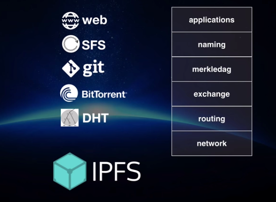
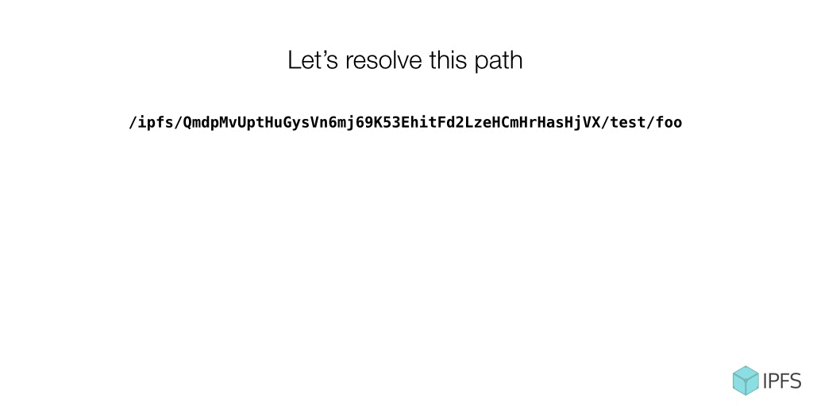

#  IPFS Architecture Overview


**Authors(s)**:
- [Juan Benet](https://github.com/jbenet)
- [David Dias](https://github.com/daviddias)

**Maintainer(s)**:
- N/A

* * *

**Abstract**

This spec document defines the IPFS protocol stack, the subsystems, the interfaces, and how it all fits together. It delegates non-interface details to other specs as much as possible. This is meant as a top-level view of the protocol and how the system fits together.

Note, this document is not meant to be an introduction of the concepts in IPFS and is not recommended as a first pass to understanding how IPFS works. For that, please refer to the [IPFS paper](https://github.com/ipfs/papers/raw/master/ipfs-cap2pfs/ipfs-p2p-file-system.pdf).

# Table of Contents

- 1. IPFS and the Merkle DAG
- 2. Nodes and Network Model
- 3. The Stack
- 4. Applications and Datastructures -- on top of IPFS
- 5. Lifetime of fetching an object
- 6. IPFS User Interfaces

# 1. IPFS and the Merkle DAG

At the heart of IPFS is the MerkleDAG, a directed acyclic graph whose links are hashes. This gives all objects in IPFS useful properties:

- authenticated: content can be hashed and verified against the link
- permanent: once fetched, objects can be cached forever
- universal: any datastructure can be represented as a merkledag
- decentralized: objects can be created by anyone, without centralized writers

In turn, these yield properties for the system as a whole:

- links are content addressed
- objects can be served by untrusted agents
- objects can be cached permanently
- objects can be created and used offline
- networks can be partitioned and merged
- any datastructure can be modelled and distributed
- (todo: list more)

IPFS is a stack of network protocols that organize agent networks to create, publish, distribute, serve, and download merkledags. It is the authenticated, decentralized, permanent web.


# 2. Nodes and Network Model

The IPFS network uses PKI based identity. An "ipfs node" is a program that can find, publish, and replicate merkledag objects. Its identity is defined by a private key. Specifically:

```
privateKey, publicKey := keygen()
nodeID := multihash(publicKey)
```

See more in the [IPFS keystore spec](https://github.com/ipfs/specs/blob/master/KEYSTORE.md).

## 2.1 multihash and upgradeable hashing

All hashes in ipfs are encoded with [multihash](https://github.com/jbenet/multihash/), a self-describing hash format. The actual hash function used depends on security requirements. The cryptosystem of IPFS is upgradeable, meaning that as hash functions are broken, networks can shift to stronger hashes. There is no free lunch, as objects may need to be rehashed, or links duplicated. But ensuring that tools built do not assume a pre-defined length of hash digest means tools that work with today's hash functions will also work with tomorrows longer hash functions too.

As of this writing, IPFS nodes _must_ support:

```
sha2-256
sha2-512
sha3
```


# 3. The Stack

IPFS has a stack of modular protocols. Each layer may have multiple implementations, all in different modules. This spec will only address the interfaces between the layers, and briefly mention possible implementations. Details are left to the other specs.

IPFS has five layers:

- **naming** - a self-certifying PKI namespace (IPNS)
- **merkledag** - datastructure format (thin waist)
- **exchange** - block transport and replication
- **routing** - locating peers and objects
- **network** - establishing connections between peers



These are briefly described bottom-up.

## 3.1 Network

The **network** provides point-to-point transports (reliable and unreliable) between any two IPFS nodes in the network. It handles:
- NAT traversal - hole punching, port mapping, and relay
- supports multiple transports - TCP, SCTP, UTP, ...
- supports encryption, signing, or clear communications
- multi-multiplexes -multiplexes connections, streams, protocols, peers, ...

See more in the [libp2p specs](https://github.com/libp2p/specs).

## 3.2 Routing -- finding peers and data

The IPFS **Routing** layer serves two important purposes:
- **peer routing** -- to find other nodes
- **content routing** -- to find data published to ipfs

The Routing Sytem is an interface that is satisfied by various kinds of implementations. For example:

- **DHTs:** perhaps the most common, DHTs can be used to create a semi-persistent routing record distributed cache in the network.
- **mdns:** used to find services advertised locally. `mdns` (or `dnssd`) is a local discovery service. We will be using it.
- **snr:** supernode routing is a delegated routing system: it delegates to one of a set of supernodes. This is roughly like federated routing.
- **dns:** ipfs routing could even happen over dns.

See more in the [libp2p specs](https://github.com/libp2p/specs).

## 3.3 Block Exchange -- transferring content-addressed data

The IPFS **Block Exchange** takes care of negotiating bulk data transfers. Once nodes know each other -- and are connected -- the exchange protocols govern how the transfer of content-addressed blocks occurs.

The Block Exchange is an interface that is satisfied by various kinds of implementations. For example:

- **Bitswap:** our main protocol for exchanging data. It is a generalization
  of BitTorrent to work with arbitrary (and not known apriori) DAGs.
- **HTTP:** a simple exchange can be implemented with HTTP clients and servers.

## 3.4. Merkledag -- making sense of data

[As discussed above](#IPFS-and-the-Merkle-DAG), the IPFS **merkledag** (also known as IPLD - InterPlanetary Linked Data) is the datastructure at the heart of IPFS. It is an [acyclic directed graph](http://en.wikipedia.org/wiki/Directed_acyclic_graph) whose edges are hashes. Another name for it is the merkleweb.

The merkledag data structure is:

```protobuf
message MDagLink {
  bytes Hash = 1;    // multihash of the target object
  string Name = 2;   // utf string name. should be unique per object
  uint64 Tsize = 3;  // cumulative size of target object
}

message MDagNode {
  MDagLink Links = 2;  // refs to other objects
  bytes Data = 1;      // opaque user data
}
```

The merkledag is the "thin waist" of authenticated datastructures. It is a minimal set of information needed to represent + transfer arbitrary authenticated datastructures. More complex datastructures are implemented on top of the merkledag, such as:

- **git** and other version control systems
- **bitcoin** and other blockchains
- **unixfs**, a content-addressed unix filesystem

See more in the [IPLD spec](https://ipld.io/specs/).

## 3.4.1 Merkledag Paths

The merkledag is enough to resolve paths:

```
/ipfs/QmdpMvUptHuGysVn6mj69K53EhitFd2LzeHCmHrHasHjVX/test/foo
```

- (a) Would first fetch + resolve `QmdpMvUptHuGysVn6mj69K53EhitFd2LzeHCmHrHasHjVX`
- (b) Then look into the links of (a), find the hash for `test`, and resolve it
- (c) Then look into the links of (b), find the hash for `foo`, and resolve it

See more in the [path resolution spec](https://github.com/ipld/specs/blob/master/data-model-layer/paths.md).



## 3.5 Naming -- PKI namespace and mutable pointers

IPFS is mostly concerned with content-addressed data, which by nature is immutable: changing an object would change its hash -- and thus its address, making it a _different_ object altogether. (Think of it as a copy-on-write filesystem).

The IPFS **naming** layer -- or IPNS -- handles the creation of:
- mutable pointers to objects
- human-readable names

IPNS is based on [SFS](http://en.wikipedia.org/wiki/Self-certifying_File_System). It is a PKI namespace -- a name is simply the hash of a public key. Whoever controls the private key controls the name. Records are signed by the private key and distributed anywhere (in IPFS, via the routing system). This is an egalitarian way to assign mutable names in the internet at large, without any centralization whatsoever, or certificate authorities.

See more in the [IPNS spec](https://github.com/ipfs/specs/blob/master/IPNS.md).

# 4. Applications and Datastructures -- on top of IPFS

The stack described so far is enough to represent arbitrary datastructures and replicate them across the internet. It is also enough to build and deploy decentralized websites.

Applications and datastructures on top of IPFS are represented as merkledags. Users can create arbitrary datastructures that extend the merkledag and deploy them to the rest of the world using any of the tools that understand IPFS.

See more in the [IPLD datastructures specs](https://github.com/ipld/specs/tree/master/data-structures).

## 4.1 unixfs -- representing traditional files

The unix filesystem abstractions -- files and directories -- are the main way people conceive of files in the internet. In IPFS, `unixfs` is a datastructure that represents unix files on top of IPFS. We need a separate datastructure to carry over information like:

- whether the object represents a file or directory.
- total sizes, minus indexing overhead

See more in the [unixfs spec](https://github.com/ipfs/specs/blob/master/UNIXFS.md).

## 5. Lifetime of fetching an object.

Suppose we ask an IPFS node to retrieve

```
/ipfs/QmdpMvUptHuGysVn6mj69K53EhitFd2LzeHCmHrHasHjVX/test/foo
```

The IPFS node first splits the path into components (discarding the `ipfs` prefix):

```
[ "QmdpMvUptHuGysVn6mj69K53EhitFd2LzeHCmHrHasHjVX", "test", "foo" ]
```

Then, the IPFS node resolves the components.
The first component in an `/ipfs/...` path is always a multihash.
The rest are names of links, to be resolved into multihashes.

# 6. IPFS User Interfaces

IPFS is not just a protocol. It is also a toolset. IPFS implementations include various tools for working with the merkledag, how to publish something, how to name something, etc. These interfaces may be critical to the survival of an implementation, or the project as a whole. These interfaces govern how people use IPFS, thus careful attention must be given to their design and implementation. Examples:

- The [IPFS api](https://docs.ipfs.io/reference/api/http/) - an HTTP service
- The [IPFS cli](https://docs.ipfs.io/reference/api/cli/) - a unix cli
- The [IPFS libs](https://github.com/ipfs/ipfs#http-client-libraries) - implementations in various languages
- The IPFS gateways - nodes in the internet that serve HTTP over IPFS

* * *

# WIP Stack Dump:

- How the layers fit together
- How they call on each other
- Mention all the ports
- Mention all the interfaces with the user
- Mention gateways
