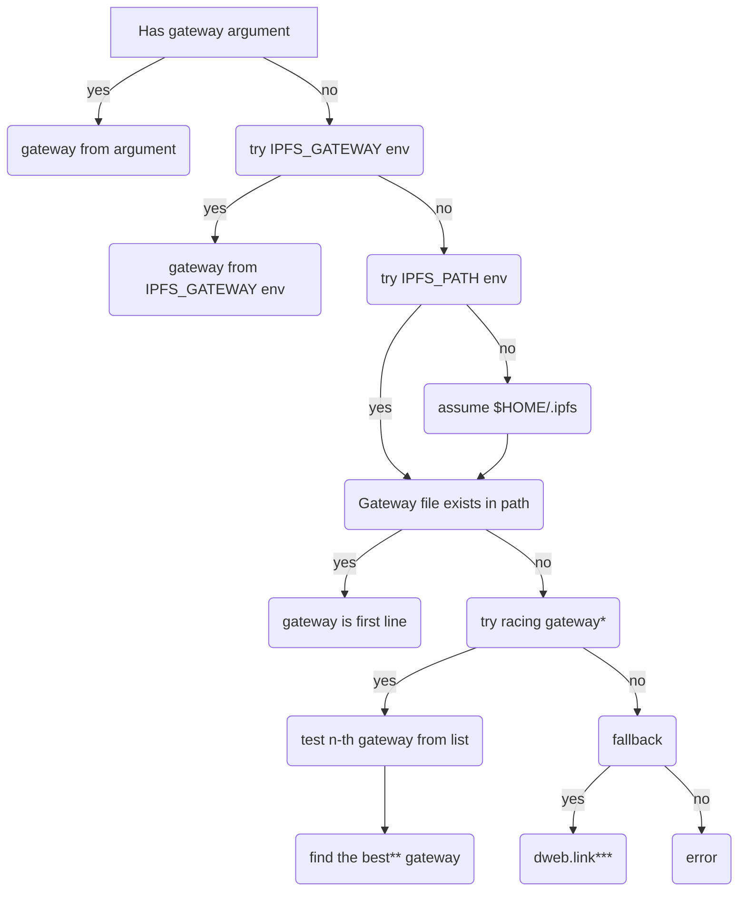

# Gateway Integration

**Author(s)**:
- [Mark Gaiser](https://github.com/markg85/)

**Maintainer(s)**:
- [Mark Gaiser](https://github.com/markg85/)

* * *

## Summary

Defines the decision model an IPFS enabled application should use to find a IPFS gateway. Simultaneously defines how an IPFS implementation should expose it's gateway.

For clarity upon reading this document:
**IPFS implementation**, this is an application implementing (a set of) the IPFS specifications. It would expose a gateway for other applications to use. Examples here are KUBO and Iroh.

**IPFS integration**, this is an application integrating the IPFS protocol support. Meaning that an application "integrating IPFS" can fetch IPFS resources. These applications often are using gateways to implement IPFS support. Examples here are ffmpeg and curl.

## Motivation

Applications wanting to use IPFS resources are, without this spec, left to invent their own ways of finding a gateway. This spec defines how application wanting to implement IPFS support can find a gateway.

Simultaneously the spec also defines how IPFS implementations should expose their gateway.

## Detailed design

This integration spec defines the recommended way for a third party applications to integrate IPFS support in their application and thereby gaining easy access to resources stored on the IPFS platform.

Integration here has 2 different meanings.

1. The implementing application can handle IPFS resources with the `ipfs` and `ipns` protocols. As an example, the implementing application should be able to handle a url in this format `ipfs://QmbGtJg23skhvFmu9mJiePVByhfzu5rwo74MEkVDYAmF5T` which in this case would give you the big buck bunny video. Likewise a url in the `ipns` should be handled too. Making these protocols usable is left up to the specific application implementing this support.

2. One way to handle the protocols is to use the [HTTP gateway](https://docs.ipfs.tech/concepts/ipfs-gateway/). This document describes how to determine which gateway to use.

### Decision tree

The below decision tree defines the decisions to be made in order to choose the proper gateway. Do note that the tree, when implementing this logic, is more elaborate then this tree makes you think it is. Validation here is left out of the tree but should be added in a local implementation.

\* `try racing gateway` depends on the environment variable `IPFS_RACING_GATEWAY`. See below for details.

\** `find the best* gateway`. The heuristics to find the best gateway are as follows. A racing gateway logic fires of a request to n-th gateways simultaneously (say 10 gateways out of a list of potentially 100's). Of those 10, the one that responds fastest is stored in a list. If this one is already responding within 50ms then this gateway is used. If this one is taking more then 200ms then the next batch of 10 gateways is probed. This flow continues till:
1. a gateway with a response below 50ms has been found
2. gateways have been probed for over 2 seconds (in which case it just stops and uses the fastest one).

The result of this probe will be stored in `$CONFIG/ipfs/racing_gateway_response` as a single line being the gateway that responded fastest. In subsequent racing gateway requests this file will be read and used as starting point. If this gateway still responds within 50ms then no other gateways will be probed.

\*** `dweb.link`, see the below `IPFS_FALLBACK_GATEWAY` for details.

#### Environment variables

The decision tree is influences by a couple environement variables.

**`IPFS_RACING_GATEWAY`** When this environemnt variable isn't found (the default), racing gateways should be attempted upon reaching this point in the flow. When the environment variable exists it's value should be used. If it's value is `1` (or `true`) then racing gateways should be attempted. If this value is `0` (or `false`) then racing gateways are off. The control flow proceeds in the `no` branch.

**`IPFS_FALLBACK_GATEWAY`** When this variable doesn't exist `dweb.link` will be used. When the variable does exist it's value will be used instead.

### Gateway from command argument

**This feature is optional and only for applications integrating IPFS support.**

An application can opt to support a command line option to provide a gateway. If a user does provide this option then it should overrule any other gateway detection and be used as the gateway of choice. If implemented, it's recommended to go for either a `--gateway` or `--ipfs-gateway` argument. It depends very much on the application itself as to which option is most sensible.

An example implementation that is doing this is ffmpeg with the ffplay utility. It allows the `-gateway` argument which by default is empty but can be set like: `-gateway http://127.0.0.1:8080` and would then be used to handle `ipfs://<cid>` or `ipns://<cid>`.

### Gateway from IPFS_GATEWAY environment variable

When there is no command line argument, the `IPFS_GATEWAY` environment is next. If it contains a value, it will be used as gateway.

### Gateway file

**This feature is only for IPFS implementers, not for IPFS application integrations.**

When the implementation provides a gateway (and it's not disabled through other means) then it should make that known to other local applications. The gateway file serves this purpose. It's a file with only 1 single line containing the full http URL to your gateway. For example, it could contain the line: "http://localhost:8080".

The file conditions:
    1. is named "gateway"
    2. **only** exists when your implementation actually starts a gateway
    3. is removed when your implementation shuts down

For historical and compatibility readons, this file shall be placed in:
$HOME/.ipfs/ thus the resulting end path is going to be $HOME/.ipfs/gateway

Future implementers must follow the [XDG Base Directory Specification](https://specifications.freedesktop.org/basedir-spec/basedir-spec-latest.html) where the gateway file will placed in:
**$XDG_CONFIG_HOME/ipfs/gateway**

The conditions for this file are the same as those in $HOME/.ipfs/gateway.

In the, admitedly rare, event of running multiple IPFS implementations each hosting their own gateway. First-come-first-serve applies here. The application that created the gateway file owns it and takes care of removing it. Subsequent instances or different application should not touch the file if it's already there.

### Example implementations

#### ffmpeg

As of ffmpeg 5.1, it implements this logic. The source for it's implementation can be found [here](https://github.com/FFmpeg/FFmpeg/blob/master/libavformat/ipfsgateway.c).

#### curl

The implementation for curl is currently a work in progress but it too follows the steps as outlined in the decision tree.

#### libipfsclient

A reference implementation of this spec along with more functionality to retrieve data from IPFS. This is intended to be used by applications wanting to implement IPFS support.

## Test fixtures

N/A

## Design rationale

To simplify IPFS integrations in third party applications it's important to know if said application can use a gateway. This spec defines the rules to find such a gateway and/or how to influence it.

### User benefit

Users as in applications using IPFS. They get a defined way to find out if their host pc runs an IPFS gateway. Without this spec there is no defined way.

### Compatibility

Kubo currently makes `$HOME/.ipfs/gateway`, this should stay for backwards compatibility.
A new version implementing this spec should create `$XDG_CONFIG_HOME/ipfs/gateway` in exactly the same fashion.

### Security

N/A

### Alternatives

There are no alternatives I'm aware of. There is [this](https://github.com/ipfs/kubo/issues/8847) issue that predates this very IPIP but also serves as starting block to this IPIP.

### Copyright

Copyright and related rights waived via [CC0](https://creativecommons.org/publicdomain/zero/1.0/).
