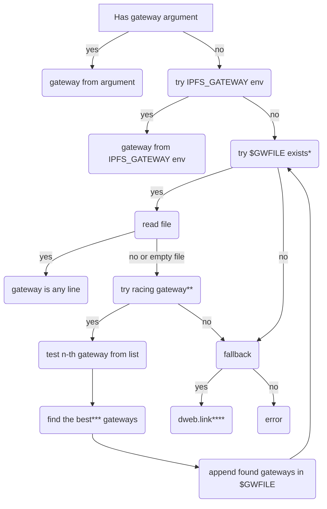

# Gateway Integration

**Author(s)**:
- [Mark Gaiser](https://github.com/markg85/)

**Maintainer(s)**:
- [Mark Gaiser](https://github.com/markg85/)

* * *

## Summary

Defines the decision model an IPFS enabled application should use to find a IPFS gateway. Simultaneously defines how an IPFS implementation should expose it's gateway.

For clarity upon reading this document:
**IPFS implementation**, this is an application implementing (a set of) the IPFS specifications. It would expose a gateway for other applications to use. Examples here are KUBO and Iroh.

**IPFS integration**, this is an application integrating the IPFS protocol support. Meaning that an application "integrating IPFS" can fetch IPFS resources. These applications often are using gateways to implement IPFS support. Examples here are ffmpeg and curl.

## Motivation

Applications wanting to use IPFS resources are, without this spec, left to invent their own ways of finding a gateway. This spec defines how an application wanting to implement IPFS support can find (at least one) gateway to use.

Simultaneously the spec also defines how IPFS implementations should expose their gateway.

## Detailed design

This integration spec defines the recommended way for a third party applications to integrate IPFS support in their application and thereby gaining easy access to resources stored on the IPFS platform.

Integration here has 2 different meanings.

1. The implementing application can handle IPFS resources with the `ipfs` and `ipns` protocols. As an example, the implementing application should be able to handle a url in this format `ipfs://QmbGtJg23skhvFmu9mJiePVByhfzu5rwo74MEkVDYAmF5T` which in this case would give you the big buck bunny video. Likewise a url in the `ipns` should be handled too. Making these protocols usable is left up to the specific application implementing this support.

2. One way to handle the protocols is to use the [HTTP gateway](https://docs.ipfs.tech/concepts/ipfs-gateway/). This document describes how to determine which gateway to use.

### $CONFIG folder, $GWFILE and $LAGACY_GWFILE

Throughout this spec you might see `$CONFIG/ipfs/...`. `$CONFIG` is a mere abbreviation for the config folder, the variable doesn't exist and only serves to make this spec more readable. This section defines where `$CONFIG` should point to in a cross-platform manner.

As a reference, [this](https://github.com/cjbassi/platform-dirs-rs#path-list) list of configuration folders is used.

| | with variables | full paths |
| -------- | -------- | -------- |
| Windows     | %APPDATA%/ipfs     | C:/Users/%USERNAME%/AppData/Roaming/ipfs     |
| macOS     | $XDG_CONFIG_HOME/ipfs     | ~/Library/Application Support/ipfs     |
| Linux     | $XDG_CONFIG_HOME/ipfs     | ~/.config/ipfs     |

In the same manner as $CONFIG, $GATEWAY and $LEGACY_GATEWAY are names for this spec only to simplify reading.

`$GWFILE` = `$CONFIG/gateways`
`$LEGACY_GWFILE` = `~/.ipfs/gateway`

### Gateway file and Legacy gateway file
#### For KUBO only
The legacy gateway file ($LAGACY_GWFILE) was made up as a response to a need to know which gateway an IPFS node would expose. While that file itself was never specced out, it served the need. Some applications are using this file therefore the file has to be maintained for the KUBO reference implemenation. Any other IPFS implementation should ignore $LAGACY_GWFILE.

The file only contains a single line being the http gateway url. For example: "http://localhost:8080".

The file conditions:
    1. is named "gateway"
    2. **only** exists when KUBO actually starts a gateway
    3. is removed when KUBO shuts down

Future KUBO implemenations will do the above via symlinking `$LAGACY_GWFILE` to `$GWFILE` while maintaining the same rules as stated above.

#### For all implemenations
The gateway file ($GWFILE) is a successor to the $LAGACY_GWFILE. This new file is stored in a vendor agnostic location and contians a list of gateways. The file can be empty and even non-existing.

### Decision tree

The below decision tree defines the decisions to be made in order to choose the proper gateway. Do note that the tree, when implementing this logic, is more elaborate then this tree makes you think it is. Validation here is left out of the tree but should be added in a local implementation.

\* `try $GWFILE exists` in case of KUBO, a legacy path should be done here when `$GWFILE` doesn't exists. It should check for `$LEGACY_GWFILE` and proceed with it's output instead. Any other implementation can ignore this point.

\** `try racing gateway` depends on the environment variable `IPFS_RACING_GATEWAY`. See below for details.

\*** `find the best* gateways`. The heuristics to find the best gateway are as follows. A racing gateway logic fires a request to n-th gateways simultaneously (say 10 gateways out of a list of potentially 100's). Of those 10, those that respond within 300ms are appended in $GWFILE. This flow continues till:
1. all gateways in the list have been checked
2. more then 2 seconds have passed in which case it aborts all current and pending requests

The result of this probe will be stored in `$GWFILE` as a list of gateways that responded within the set bounds.

\**** `dweb.link`, see the below `IPFS_FALLBACK_GATEWAY` for details.

#### Environment variables

The decision tree is influenced by a couple environement variables.

**`IPFS_RACING_GATEWAY`** When this environemnt variable isn't found (the default), racing gateways will be attempted upon reaching this point in the flow. When the environment variable exists it's value should be used. If it's value is `1` (or `true`) then racing gateways should be attempted. If this value is `0` (or `false`) then racing gateways are off. The control flow proceeds in the `no` branch.

**`IPFS_FALLBACK_GATEWAY`** When this variable doesn't exist `dweb.link` will be used. When the variable does exist it's value will be used instead.

### Gateway from command argument

**This feature is optional and only for applications integrating IPFS support.**

An application can opt to support a command line option to provide a gateway. If a user does provide this option then it should overrule any other gateway detection and be used as the gateway of choice. If implemented, it's recommended to go for either a `--gateway` or `--ipfs-gateway` argument. It depends very much on the application itself as to which option is most sensible.

An example implementation that is doing this is ffmpeg with the ffplay utility. It allows the `-gateway` argument which by default is empty but can be set like: `-gateway http://127.0.0.1:8080` and would then be used to handle `ipfs://<cid>` or `ipns://<cid>`.

### Gateway from IPFS_GATEWAY environment variable

When there is no command line argument, the `IPFS_GATEWAY` environment is next. It should contain 1 and only 1 gateway http address.

### Example implementations

#### ffmpeg

As of ffmpeg 5.1, it implements this logic. The source for it's implementation can be found [here](https://github.com/FFmpeg/FFmpeg/blob/master/libavformat/ipfsgateway.c).

#### curl

The implementation for curl is currently a work in progress but it too follows the steps as outlined in the decision tree.

#### libipfsclient

A reference implementation of this spec along with more functionality to retrieve data from IPFS. This is intended to be used by applications wanting to implement IPFS support.

## Test fixtures

N/A

## Design rationale

To simplify IPFS integrations in third party applications it's important to know if said application can use a gateway. This spec defines the rules to find such a gateway and/or how to influence it.

### User benefit

Users as in applications using IPFS. They get a defined way to find out if their host pc runs an IPFS gateway. Without this spec there is no defined way.

### Compatibility

See [Gateway file and Legacy gateway file](#Gateway-file-and-Legacy-gateway-file).

### Security

N/A

### Alternatives

There are no alternatives I'm aware of. There is [this](https://github.com/ipfs/kubo/issues/8847) issue that predates this very IPIP but also serves as starting block to this IPIP.

### Copyright

Copyright and related rights waived via [CC0](https://creativecommons.org/publicdomain/zero/1.0/).
