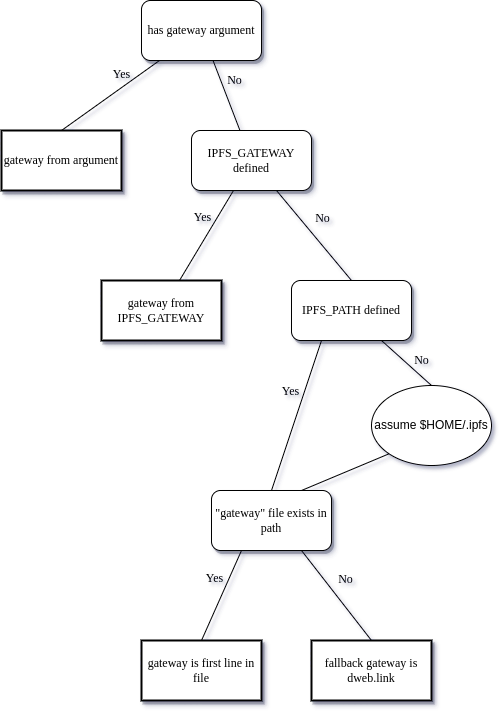

#  Integration  <!-- omit in toc -->

**Author(s)**:
- [Mark Gaiser](https://github.com/markg85/)

* * *

**Abstract**
This integration spec defines the recommended way for a third party applications to integrate IPFS support in their application and thereby gaining easy access to resources stored on the IPFS platform.

Integration here has 2 different meanings.

1. The implementing application can handle IPFS resources with the `ipfs` and `ipns` protocols. As an example, the implementing application should be able to handle a url in this format `ipfs://QmbGtJg23skhvFmu9mJiePVByhfzu5rwo74MEkVDYAmF5T` which in this case would give you the big buck bunny video. Likewise a url in the `ipns` should be handled too. Making these protocols usable is left up to the specific application implementing this support.

2. One way to handle the protocols is to use the [http gateway](https://docs.ipfs.io/concepts/ipfs-gateway/). This document describes how to determine that gateway to use.

## Decision tree
The below decision tree defines the decisions to be made in order to choose the proper gateway. Do note that the tree, when implementing this logic, is more elaborate then this tree makes you think it is. Validation here is left out of the tree but should be added in a local implementation.

### Gateway from command argument
An application can opt to support a command line option to provide a gateway. A user should not _need_ to provide this and should therefore be considered optional. However, if a user does provide this option then it should overrule any other gateway detection and be used as the gateway to use. An example implementation that is doing this is ffmpeg with the ffplay utility. It allows the `-gateway` argument which by default is empty but can be set like: `-gateway http://127.0.0.1:8080` and would then be used to handle `ipfs://<cid>` or `ipns://<cid>`.

### Gateway from IPFS_GATEWAY environment variable
When there is no command line argument, the `IPFS_GATEWAY` environment is next. If it contains a value, it should be used as gateway.

### Gateway file from IPFS_PATH environment variable or home folder ipfs data
If the `IPFS_PATH` environment variable is defined, it should point to the ipfs data folder. If this environment variable isn't defined then an attempt should be made to see if `$USER/.ipfs` exists and consider that to be the IPFS data folder when it does.

If this turns out to be an existing path the existence of the `gateway` file in that path should be checked for. If gateway file exists then the first line should be considered to be the full url to the local IPFS gateway.

Do note that this gateway file logic relies on the future implementation of having the gateway file be auto-generated. It's specced [here](https://github.com/ipfs/go-ipfs/issues/8847) and is approved to be implemented. Implementers of this spec should act as if that gateway file already exists!

## Validation and fallback gateway
All of the above describes what should ideally be done. Validation of any kind is up to the application implementing IPFS support. To provide an "always working" feeling, implementers are recommended to use a fallback gateway and they should pick `dweb.link`. That gateway is maintained by Protocol Labs and is allowed to be used for this purpose.

## Current implementations
### ffmpeg
As of ffmpeg 5.1, it implements this logic. The source for it's implementation can be found [here](https://github.com/FFmpeg/FFmpeg/blob/master/libavformat/ipfsgateway.c).

### mpv
mpv itself isn't doing any of this, it relies on the ffmpeg implementation.

### curl
The implementation for curl is currently a work in progress but it too follows the steps as outlined in the decision tree.