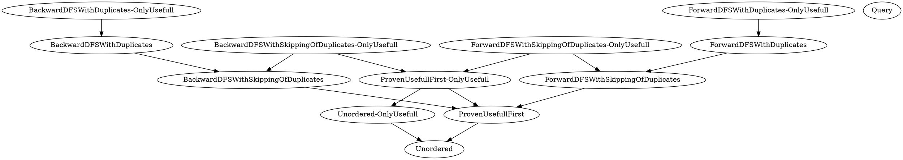

# IPIP 0000: InterPlanetary Improvement Proposal Template

- Start Date: 2022-10-07
- Related Issues:
  - Car Spec https://ipld.io/specs/transport/car/carv1/

This IPIP follow RFC2119.

## Summary

Specify a traversal order allowing exchange of ready-to-unpack car files.

## Motivation

We are building light-clients for IPFS.

Thoses uses the [trustless gateway](../http-gateways/TRUSTLESS_GATEWAY.md) specs to download raw blocks and car files and only do content verifications.

This allows to delegate most expensive tasks to remote servers, and only do cryptographic verifications.

We want them to have low memory footprints on arbitrary sized files.
The main pain point preventing this is the fact that CAR ordering isn't specified.

This require to keeping some kind of reference either on disk, or in memory to previously seen blocks for two reasons.
1. Blocks can arrive out of order, meaning when a block is consumed (data is red and returned to the consumer) and when it's received might not match.
1. Blocks can be reused multiple times, this is handy for cases when you plan to cache on disk but not at all when you want to process a stream with use & forget policy.

What we really want is for the gateway to help us a bit, and give us blocks in a useful order.

## Detailed design

Add a qualifying parameter to the `Accept` Header to how the blocks should be transfered.

The block order correspond to someone reading the car file `Data` section (see car specification) from low index to high indexes.
In other words, blocks are sent first when streaming the car file over a fifo byte stream such as TCP connection, unix pipe, ... they are readable first.

`BlockOrder`, `enum (string)`, defaults to `Unordered`

They are generally adding increasing level of compatible constraints,
this mean a server implementation might choose to implement only some of the most restrictive one and use overly restrictive one for continence.
The Compatibility graph looks like this:


Compatible means that gateway is MAY answer with childs (direct or indirect) of a particular ordering if it wish to.

A gateway MUST answer with a stronger compatible ordering if one is available.

A gateway is allowed and SHOULD answer with a more strict `BlockOrder` type if this is what is really used under the hood.
For example an implementation that doesn't do any particular more optimisation when asked `Unordered` and actually answer `ProvenUsefullFirst` SHOULD set `Content-Type` to `application/vnd.ipld.car; BlockOrder=ProvenUsefullFirst`.

### Orderings

Note for all of them, we follow multihash keying,
if they allows not sending the same blocks multiple times, if multihash A has been sent with codec 1,
and then if multihash A is seen again but with codec 2, you may not send this block,
however you MUST NOT stop the traversal because the same hash decoded two way may have different descent.

For gateways:

`Unordered` is the only MUST implement ordering.

- `ProvenUsefullFirst`
- `ForwardDFSWithSkippingOfDuplicates`
- `ForwardDFSWithDuplicates`

are SHOULD implement orderings.

- `BackwardDFSWithSkippingOfDuplicates`
- `BackwardDFSWithDuplicates`

are MAY implement orderings.

Adding `-OnlyUsefull` SHOULD be implemented by the gateway assuming they actually implement such feature.

Implementing a stricter compatible ordering counts as ordering other compatible orderings.

#### `Unordered`

This is the current state of things and the default when `BlockOrder` requests.

All blocks found doing a DFS search of all the roots must eventually be found in the file.

Order is totally undefined and blocks might have duplicates as well as include blocks not part of the request.

Altho you can have duplicates, this really meant to allows reverse proxies to cache more restrictive ones if they wish.
Implementations SHOULD NOT emit duplicated blocks because this is a waste of bandwidth.

##### `Unordered-OnlyUsefull`

Because `Unordered` never cares about which blocks are received while reading, ensuring all blocks are useful would need to be finalized at the end by the client.

#### `ProvenUsefullFirst`

This is a slightly stricter version of `Unordered`.

When a block is found in the stream but have not been proven useful yet, it MUST be ignored by clients (and thus the gateway MUST NOT assume the client have correctly received it).
A block become proven useful when it has been seen as link of an other already proved useful block.
The roots are the starting proven useful when starting the request.

Note, the reason it is allowed but ignored to send useless blocks is for padding purposes, some implementations include small empty blocks in order to pad data to 4096.
We want to be compatible with such implementations.

We expect most concurrent oriented gateways to use this as their default because it keep bandwidth usage small and correspond to concurrent dag traversal patterns.

The server SHOULD avoid sending the same blocks multiple times.

#### `ForwardDFSWithSkippingOfDuplicates`, `BackwardDFSWithSkippingOfDuplicates`

In this mode, DFS is precisely required either `Forward` or `Backward` (thoses indicates respectively weather maps and list should be traversed from low or high indexes first).

In case a block that isn't precisely the next block in the DFS traversal is found it MUST be skipped by the client (and thus the gateway MUST NOT assume the client have correctly received it).

The gateway SHOULD avoid sending the same blocks multiple times,
the canonical way to do this is to create a seen CID set, add every CID traversed to it, then when traversing if the CID is in the set skip this branch completely.

### `ForwardDFSWithDuplicates`, `BackwardDFSWithDuplicates`

In this mode you do a DFS either `Forward` or `Backward` (thoses indicates respectively weather maps and list should be traversed from low or high indexes first).

But unlike `ForwardDFSWithSkippingOfDuplicates` and `BackwardDFSWithSkippingOfDuplicates` you do not keep track of already seen blocks (and thus MUST resend duplicates if they show up in multiple places in the DAG).

In case a block this isn't precisely the next block in the DFS traversal is found it MUST be skipped by the client (and thus the gateway MUST NOT assume the client have correctly received it).

This traversal order is actually in the goal of saving bandwidth.

Clients using this would not keep any reference to previously downloaded data, so if the gateway didn't supported this mode, it would need to do many more requests to redownload skipped part of the DAG.

### `Query`

This order MUST NOT be suppported by the gateway.

This is the canonical way to trigger a failure and thus query which orderings are supported.

### `-OnlyUsefull` suffix

You can add `-OnlyUsefull` suffix to all orderings except `Query`, this mean every time a block would have been skipped by the client, this is now an error instead.

Clients are free to read `-OnlyUsefull` cars like non `-OnlyUsefull` cars (and thus skip blocks if they don't wish to do the verification).

This can also be a hint to cache layers (a `-OnlyUsefull` car file would be more interesting because it might be smaller)

### Requests

Clients MAY specify it by qualifying the `Accept` header.

For example:

- `Accept: application/vnd.ipld.car; BlockOrder=ForwardDFSWithSkippingOfDuplicates` means it is intrested in either one of:
  - `ForwardDFSWithSkippingOfDuplicates`
  - `ForwardDFSWithSkippingOfDuplicates-OnlyUsefull`
  - `ForwardDFSWithDuplicates`
  - `ForwardDFSWithDuplicates-OnlyUsefull`
- `Accept: application/vnd.ipld.car; BlockOrder=Unordered` would accept anything.

Clients may qualify it multiple times, for example
`Accept: application/vnd.ipld.car; BlockOrder=ForwardDFSWithSkippingOfDuplicates-OnlyUsefull; BlockOrder=Unordered`
in this case this is a list of preferences (lower indexes is better), the client would really like `ForwardDFSWithSkippingOfDuplicates-OnlyUsefull`
however if this isn't available it would accept `Unordered` (so anything) instead.

Clients SHOULD NOT ask for an Ordering that already covered by a previous ask, for example:
`Accept: application/vnd.ipld.car; BlockOrder=ForwardDFSWithSkippingOfDuplicates; BlockOrder=ForwardDFSWithDuplicates`
is illegal because `ForwardDFSWithDuplicates` is already compatible with `ForwardDFSWithSkippingOfDuplicates`.

In case a gateway sees this it should read this left to right and ignore already covered orderings (it can try matching it multiple times, but this would do nothing).

### Responses

#### Success

The response code MUST be 200, the body must be the car payload correctly ordered.

And the `Content-Type` header must contain the qualifier of the matching ordering, only one is allowed.

If ordering is `Unordered` ordering qualifier MAY be omitted but SHOULD NOT (this is to force compatibility with older gateways upon clients).

#### Ordering Incompatiblity

If none of the ordering requested by the client is supported the gateway MUST answer with `415 Unsupported Media Type`.

The body first line must be *some* string followed by the magic `: ` trigger.

This indicates the start of the list of supported orderings which is a `, ` list of ordering up until the next newline, which indicates the end of the list (anything past this line MUST be ignored by clients).

The list doesn't need to include implicitly compatible orderings.

Regex:
```
.*: ((((Forward|Backward)DFSWith(SkippingOf|out)Duplicates)|Unordered|ProvenUsefullFirst)(-OnlyUsefull)?)(, ((((Forward|Backward)DFSWith(SkippingOf|out)Duplicates)|Unordered|ProvenUsefullFirst)(-OnlyUsefull)?))*$
```

Example:
```
BackwardDFSWithSkippingOfDuplicates is not a supported ordering, supported orderings are: ForwardDFSWithSkippingOfDuplicates-OnlyUsefull, ForwardDFSWithDuplicates-OnlyUsefull
```

## Test fixtures

`<TODO>`

### User benefit

We will have extremely light clients allowing to use IPFS trustlessly in embeded platforms, mobile and where you need repeatable and low memory usage.

### Compatibility

Kubo already implements `ForwardDFSWithSkippingOfDuplicates-OnlyUsefull` by implementation details luck.

### Security

Not than I can think of.

### Alternatives

Heavier lighter clients that can support `Unordered` modes (default).

For example keeping preferences in memory or disk, or by using multiple requests (such as `Raw`).

Which are either impossible because of platform constraints or would cause many many more requests.

### Copyright

Copyright and related rights waived via [CC0](https://creativecommons.org/publicdomain/zero/1.0/).
