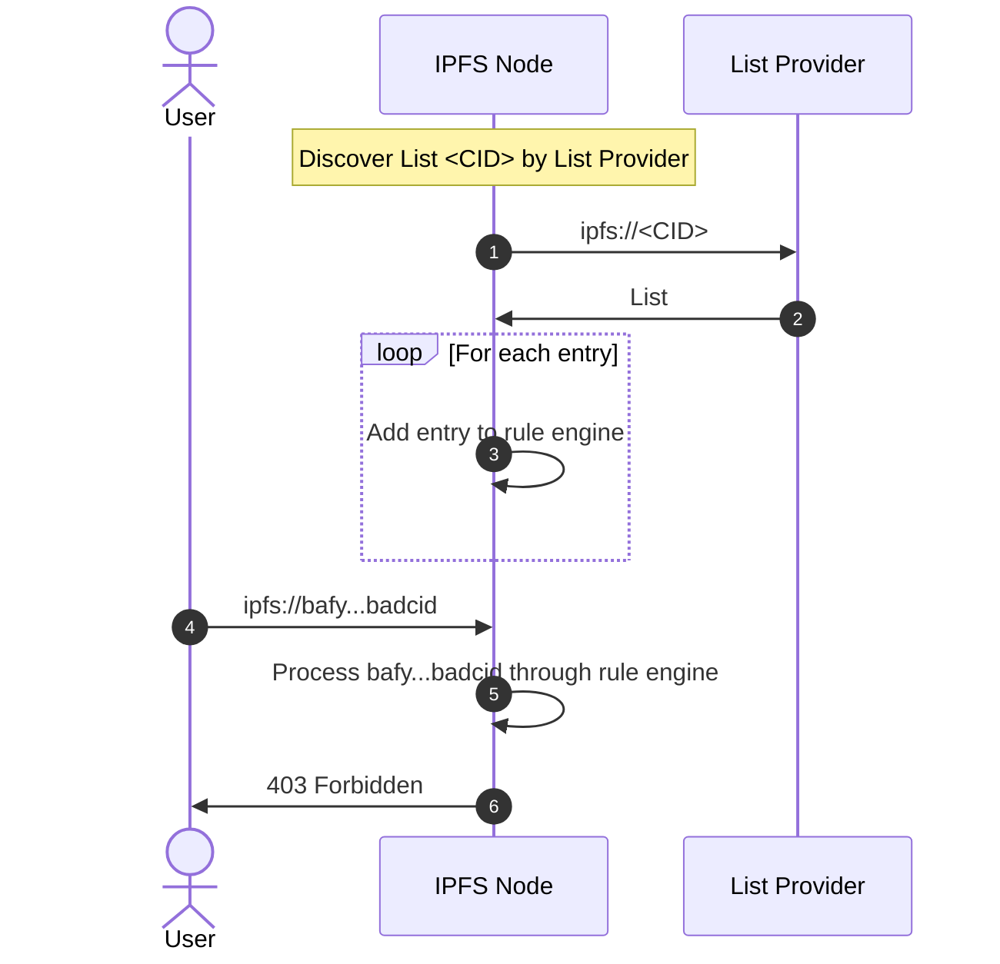

# IPIP-298: (allow|deny)list for IPFS Nodes and Gateways

- Start Date: 2022-07-14
- Related Issues:
  - [ipfs/specs/issues/298](https://github.com/ipfs/specs/issues/298)

## Summary

This issue proposes a descriptive and maintainable content lists. These can be used to help standardize content moderation for IPFS nodes and gateways. The main focus is on denylists. Allow lists are added for completeness.

## Motivation

The current [Bad Bit Denylist](https://badbits.dwebops.pub/denylist.json), which is a list of hashed CIDs, has multiple major drawbacks for implementation. One is lacking support for content path, it's hard to block an IPNS path only based on CIDs. The other is lacking description and status code response for each anchor. The description is especially for hashed blocking items, since the hashing is unidirectional, the description can outline the reason why it's been blocked thus increasing maintainability.

A well-thought-out list schema can ease the implementation of denylists, and bring consensus on how content blocking works for gateways, and node operators in the community.

## Architecture



### List Provider

A List Provider is an entity building and providing a list of content to be allowed/denied. They can provide their lists through the IPFS network or via [an HTTP Gateway endpoint](../http-gateways/README.md).

### IPFS Node

An IPFS node is a service that interacts with the IPFS network. This could be because it's providing content to the network, because it's retrieving content, or because it's serving IPFS hosted content through an HTTP interface.

To interact with content lists, it operates a rule engine. The rule engine decides what action should be taken for a particular request.
For instance, if CID bafy...badcid is denied, the bitswap engine should not request it, and access to bafy...badcid through a node exposed gateway are going to 403 forbidden.

### User

User is an actor that can make request to the IPFS Node. It's considered authenticated already.
Access to the node can be made via an HTTP gateway, Bitswap, or another transport method exposed by the IPFS Node.

It is understood that the User might be in control of the IPFS Node, and is able to configure the rule engine as it suits them.

## Schemas

### Definition

The schemas below are defined as [IPLD schemas](https://ipld.io/specs/schemas/).

```ipldsch
type List struct {
  Action Int # Suggested action to be taken
  StatusCode optional Int # HTTP status code to be returned by IPFS gateways by default

  Entries optional Entry[] # Entries included in the list
  Imports optional Bytes # CID to a chain of entries included in the list

  Description optional String # Context to be shared with the list consumers
}

type Entry struct {
  Type Int # Type of the content string. Refer to CID_V1, ABSOLUTE_PATH, PARTIAL_PATH, SHA256_CID_V1
  Content String # Encoded content based on the Type
  Description optional String # Context to be shared with the entry consumers
  StatusCode optional Int  # HTTP status code to be returned by IPFS gateways for this specific Entry
}

type EntryImport struct {
  Entries Bytes[] # List of CID associated to Entry objects
  Next nullable Bytes # CID for the next EntryImport object
}
```

### Example

Here is a denylist in the proposed format.

```javascript
{
  Action: 2, // Action.BLOCK
  StatusCode: 451,
  Description: "Denylist of ACME Corp. on 1970/01/01",
  Entries: [
    {
      Type: 0, // Type.CID_V1
      Content: "bafybeihfqymzmqhbutdd7i4mkq2ltzznzgoshi4r2pnv4hsc2acsojawoe",
      Description: "ipfs quick start"
    },
    {
      Type: 1, // Type.ABSOLUTE_PATH
      Content: "/ipns/bad.example.com",
      Description: "Bad path"
    },
    {
      Type: 2, // Type.PARTIAL_PATH
      Content: "bag.again.example.com",
      StatusCode: 410
    },
    {
      Type: 3, // Type.SHA256_CID_V1
      Content: "9056e0f9948c942c16af3564af56d4bb96b6203ad9ccd3425ec628bcd843cc39",
      Description: "sensitive cid that needs to be blocked"
    }
  ]
}
```

### Action

Action is the suggested action to be taken by the IPFS node for content present in the list. Actions are defined as follow

| Value | Code | Description |
|:------|:-----|:------------|
|0|UNDEFINED|No action to be taken|
|1|ALLOW|Content in the list should be allowed|
|2|BLOCK|Content in the list should be blocked|
|3-255|Unassigned|Reserved for future use|
|256-512|INTERNAL|This range can be used for private actions|

### Status Code

Status Code is a default HTTP status code. This is meant to be served by [IPFS HTTP Gateways](../http-gateways/README.md) upon a matching item.

This is the default HTTP Status Code for the list. If an Entry has a Status Code specified, the entry code takes priority.

For example, a status code can be [410 Gone](https://github.com/ipfs/specs/blob/main/http-gateways/PATH_GATEWAY.md#410-gone); [451 Unavailable For Legal Reasons](https://github.com/ipfs/specs/blob/main/http-gateways/PATH_GATEWAY.md#451-unavailable-for-legal-reasons) or `200 OK` for allowed entry.

### Entries

Entries is a list of content for which Action has to be taken for upon matching. Matching happens based on the type.

Matching logic may differ depending on the implementation. It is recommended to pass the request path, as well as the CIDs of the composing DAG to the rule engine.

#### Type and Content

| Value | Code | Description | Content | Match on |
|:------|:-----|:------------|:--------|:---------|
|0|CID_V1|CIDv1 of the content at the root or its children|[Multibase](https://github.com/multiformats/multibase/blob/master/multibase.csv) encoded CIDv1 as a string|Requested CID v1 at the root or its children|
|1|ABSOLUTE_PATH|Absolute path of a content from the root of a IPLD node|Path as a string|Requested path (either via https:// or ipfs://) starts with|
|2|PARTIAL_PATH|Part of a path of a content|Path as a string|Requested path contains|
|3|SHA256_CID_V1|SHA256 hased CID v1. This matches the [Double Hashing IPIP-334](https://github.com/ipfs/specs/pull/334).|SHA256 of the CIDv1 as a string|Requested CID v1 SHA256|
|4-255|Unassigned||||
|256-512|INTERNAL|This range can be used for private content type|||

> **Note on `SHA256_CID_V1` type**
>
> The main difference between non-hashed entries and hashed ones is that the CIDs or content paths in the entry will be hashed and no plaintext is shown in the list. Following the [bad bits](https://badbits.dwebops.pub/), each CID or content path is `sha256()` hashed, so it's easy to determine one way but not the other. The hashed entries are designed to store sensitive blocking items and prevent creating an easily accessible list of sensitive content.
>
> Before the hashing, all CIDv0 in `CID_V1` field is converted to CIDv1 for consistency.

#### Description

Optional description. It may be used by the List Provider to give more context on why a particular item is included in the list, and/or how to deal with it.

#### Status Code

Status Code is a default HTTP status code. This is meant to be served by [IPFS HTTP Gateways](../http-gateways/README.md) upon a matching item.

This takes precedence over the default list status code.

### Imports

Imports is a CID to the head of an EntryImport linked list. It may be use in conjunction with Entries, which inline these Entry.

Imports require the IPFS node to resolve EntryImport CID.


EntryImport is composed of:
* Entries which is a list of CID representing Entry,
* Next which is a CID to the next EntryImport. Next is null when there is no more linked EntryImport.

EntryImport requires the IPFS node to resolve Entries and Next.

The use of Imports fit an evolving list at the cost of being a two/three request-response protocol.

## Request

### Encoding

Lists are encoded as [IPLD DAG-JSON](https://ipld.io/docs/codecs/known/dag-json/) or [IPLD DAG-CBOR](https://ipld.io/docs/codecs/known/dag-cbor/).

### Transport

Requests can be made via HTTP using an IPFS gateway, or directly through the IPFS network.

Following a request, an IPFS Node has access to the DAG of the imported List.


## Design rationale

The gist of the rationale is tackling the inconveniences of blocking implementation when using [current denylist](https://badbits.dwebops.pub/denylist.json). Adding support for content path, description, status code and action can make the denylist more maintainable, extensible, and easier to implement. This is especially true when a list is maintained by multiple parties or needs to keep records for auditing.

Other minor design decisions, including CIDv1 normalization, allowing both plain text and hashed entries in one denylist, are also made to ease the implementation. It will force the consistency between multiple denylists that pave the way for wider adoption.

Allow and deny lists are important to empower gateway to make their own policy decisions. While gateway can access any IPFS content, they might decide to not serve it all. This could be for reputation concerns, for safety, or for internal reasons.


## Note to implementers

The proposed schema could ease the implementation of lists for gateway and node operators. It supports both CID and content path and each entry has a customizable description and response status code.

The other operation benefit comes after the wide adoption of the proposed denylist, a new onboard gateway operator can use a shared to start a gateway right away.

You should note that this document does not provide:

1. An authentication mechanism such as a signature over the list entry. This is left at the discretion of the implementer, and could be added as an additional IPIP, with an enveloppe over the present List schema.
2. A mandatory transport protocol. This might depend on the implementation. As long as the IPLD DAG for the List is provided, the present spec satisfy implementers needs. For HTTP gateway, it is advised to be able to import list via CID and HTTPS URLs.
3. Mutability, and therefore an update mechanism, for the list. This is left at implementers discretion. For HTTP gateways, it is advised to rely on IPNS names and HTTPS URLs, which can be pulled on a daily basis.
4. A discovery mechanism.


## Compatibility

No existing implementations yet.

JSON format is used to maximize interoperability.  The intent is for IPFS implementations and services to standardize content filtering around this format for exchanging and storing allow and deny lists.


## Security

The following concern may not lie in this scope, but it is worth to be mentioned in this proposal. The blocking of CIDs which are not malicious and are widely used can potentially jeopardize the availability of multiple sites on that IPFS gateway. Possible examples include common images, javascript bundles, or stylesheets.


## Alternatives

[Bad Bits Denylist](https://badbits.dwebops.pub/) is focusing on blocking public flagged CIDs for IPFS node operators, the blocking mainly happens between the nodes.

[Denylist implementation of NFT.Storage](https://github.com/nftstorage/nft.storage/pull/1721/files) follows the above bad bits denylist format and creates [a separated denylist](https://github.com/nftstorage/nft.storage/pull/1721/files#diff-05dcde18c34b023574f6f073330869c633ee086a5a4917de2016d49e6044a3ee) for specific usage.


## Copyright

Copyright and related rights waived via [CC0](https://creativecommons.org/publicdomain/zero/1.0/).