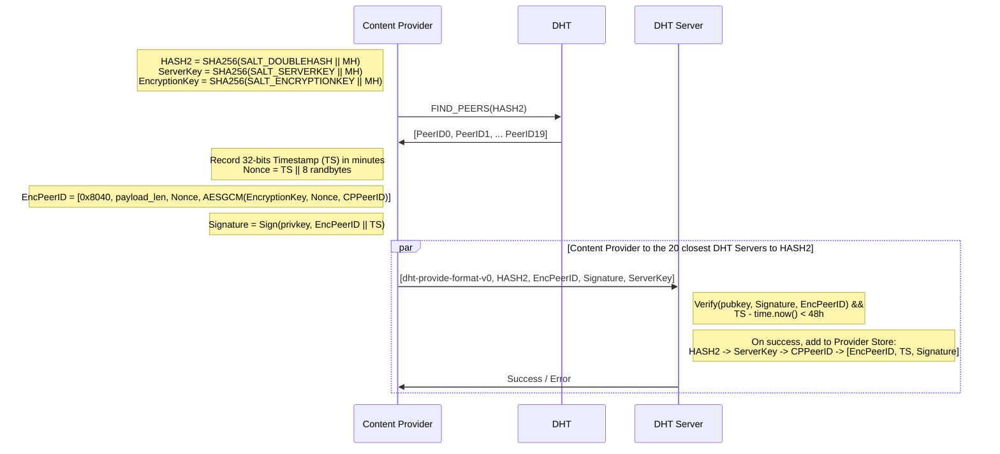
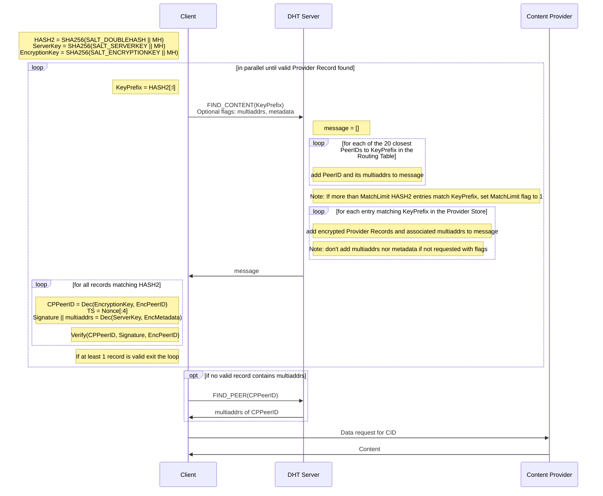

# IPIP 0000: Double Hash DHT


- DRI: [Guillaume Michel](https://github.com/guillaumemichel)
- Start Date: 2023-01-18
- Related Resources:
  - [Specs in Notion](https://pl-strflt.notion.site/Double-Hashing-for-Privacy-ff44e3156ce040579289996fec9af609)
  - [WIP Implementation](https://github.com/ChainSafe/go-libp2p-kad-dht)
  - https://github.com/ipfs/specs/pull/334
  - https://github.com/ipfs/specs/issues/345

## Summary

This IPIP contains the up-to-date Spec of the IPFS Double Hash DHT. The Double Hashing DHT aims at providing some Reader Privacy guarantees to the IPFS DHT.

This document is still WIP, all feedback is more than welcome. Make sure to write your thoughts about the [open questions](#open-questions) in the PR.

## Table of Contents

1. [Motivation](#motivation)
2. [Detailed Design](#detailed-design)
3. [Design Rationale](#design-rationale)
4. [User benefits](#user-benefits)
5. [Migration](#migration)
6. [Threat Model](#threat-model)
7. [Alternatives](#alternatives-for-dht-reader-privacy)
8. [Open Questions](#open-questions)

## Motivation

IPFS is currently lacking of many privacy protections. One of its principal weaknesses currently lies in the lack of privacy protections for the DHT content routing subsystem. Currently in the IPFS DHT, neither readers (clients retrieving content) nor writers (hosts storing and distributing content) have much privacy with regard to content they consume or publish. It is trivial for a DHT server node to associate the requestor's identity with the accessed content during the routing process. A curious DHT server node, can request the same CIDs to find out what content other users are consuming. Improving privacy in the IPFS DHT has been a strong request from the community for some time.

The changes described in this document introduce a DHT privacy upgrade boosting the reader’s privacy. It will prevent DHT tracking as described above, and add Provider Records Authentication. The proposed modifications also add a slight Writer Privacy improvement as a side effect.

## Detailed Design

**Magic Values**

- A DHT Server returns all of the Provider Records matching to at most **`MatchLimit = 64`** distinct `HASH2`. Magic number explanation in [k-anonymity](#k-anonymity).
- Provider Record Timestamp (`TS`) validity period: `48h`
- AES-GCM [varint](https://github.com/multiformats/multicodec/pull/314): `aes-gcm-256 = 0x8040`
- DHT Provide Format v0 [varint](https://github.com/multiformats/multicodec) (TBD): `dht-provide-format-v0 = 0x????` <!-- TODO -->
- DHT Provider Record Format v0 [varint](https://github.com/multiformats/multicodec) (TBD): `dht-pr-format-v0 = 0x????` <!-- TODO -->
- DHT Prefix Lookup Response Format v0 [varint](https://github.com/multiformats/multicodec) (TBD): `dht-prefix-lookup-response-format-v0 = 0x????` <!-- TODO -->
<!-- - Double SHA256 [varint](https://github.com/multiformats/multicodec/blob/master/table.csv#L41): `dbl-sha2-256 = 0x5601` -->

All salts below are 64-bytes long, and represent a string padded with `\x00`.
- `SALT_DOUBLEHASH = bytes("CR_DOUBLEHASH\x00\x00\x00\x00\x00\x00\x00\x00\x00\x00\x00\x00\x00\x00\x00\x00\x00\x00\x00\x00\x00\x00\x00\x00\x00\x00\x00\x00\x00\x00\x00\x00\x00\x00\x00\x00\x00\x00\x00\x00\x00\x00\x00\x00\x00\x00\x00\x00\x00\x00\x00")`
- `SALT_ENCRYPTIONKEY = bytes("CR_ENCRYPTIONKEY\x00\x00\x00\x00\x00\x00\x00\x00\x00\x00\x00\x00\x00\x00\x00\x00\x00\x00\x00\x00\x00\x00\x00\x00\x00\x00\x00\x00\x00\x00\x00\x00\x00\x00\x00\x00\x00\x00\x00\x00\x00\x00\x00\x00\x00\x00\x00\x00")`
- `SALT_SERVERKEY = bytes("CR_SERVERKEY\x00\x00\x00\x00\x00\x00\x00\x00\x00\x00\x00\x00\x00\x00\x00\x00\x00\x00\x00\x00\x00\x00\x00\x00\x00\x00\x00\x00\x00\x00\x00\x00\x00\x00\x00\x00\x00\x00\x00\x00\x00\x00\x00\x00\x00\x00\x00\x00\x00\x00\x00\x00")`


### Definitions

- **`CID`** is the IPFS [Content IDentifier](https://github.com/multiformats/cid)
- **`MH`** is the [Multihash](https://github.com/multiformats/multihash) contained in a `CID`. It corresponds to the digest of a hash function over some content. `MH` is represented as a 32-byte array.
- **`HASH2`** represents the location of the Kademlia keyspace for the Provider Record associated with `CID`. `HASH2` is represented as a 32-byte array. `HASH2 = SHA256(SALT_DOUBLEHASH || MH)`.
- **Content Provider** is the node storing some content, and advertising it to the DHT.
- **DHT Servers** are nodes running the IPFS public DHT. In this documents, DHT Servers mostly refer to the DHT Servers storing the Provider Records associated with specific `CID`s, and not the DHT Servers helping routing lookup requests to the right keyspace location. 
- **Client** is an IPFS client looking up a content identified by a known `CID`.
- **Publish Process** is the process of the Content Provider communicating to the DHT Servers that it provides some content identified by `CID`.
- **Lookup Process** is the process of the Client retrieving the content identified by `CID`.
- **`PeerID`** s define stable [peer identities](https://github.com/libp2p/specs/blob/master/peer-ids/peer-ids.md). The `PeerID` is derived from the node's cryptographic public key.
- **`multiaddrs`** are the [network addresses](https://github.com/libp2p/specs/tree/master/addressing) associated with a `PeerID`. It represents the location(s) of the peer.
- **`KeyPrefix`** is defined as a prefix of length `l` bits of `HASH2`. `KeyPrefix` is represented by a `byte` concatenated with a variable sized array of bytes, containing at most 32 bytes. The leading `byte` represents the binary representation of `l - 1`, making prefixes of length `256` possible, but not prefixes of length `0`. The trailing byte array is of length `ceil(l/8)` bytes, and its content is the bits prefix right padded with zeros.
- **`EncryptionKey`** is defined as `SHA256(SALT_ENCRYPTIONKEY || MH)`. It is derived from `MH` and is represented as a 32-byte array. `EncryptionKey` is used by the Content Provider to produce `EncPeerID`, making sure only a Client with the knowledge of `MH` can decrypt it.
- **`ServerKey`** is defined as `SHA256(SALT_SERVERKEY || MH)`. It is derived from `MH` and is represented as a 32-byte array. The Content Provider communicates `ServerKey` to the DHT Servers during the Publish Process. The DHT Servers use `ServerKey` to encrypt `Signature` and Content Providers `multiaddrs` sent to the Client when some Provider Records match the requested `Prefix`.
- **`TS`** is a 32-bit unsigned Integer Timestamp representing the number of minutes elapsed since `1970-01-01T00:00:00Z`, allowing timestamps to be used until `10136-02-16T04:16:00Z`. `TS` is determined by the Content Provider when (re)publishing a Provider Record. Note that `TS` is embedded in `Nonce`.
- **`Nonce`** is a 12-byte Nonce used as Initialization Vector (IV) for the AES-GCM encryption. `Nonce` is composed of `TS` concatenated with `8` random bytes. `Nonce` **must** be unique for each AES-GCM encryption performed with `EncryptionKey` for all Content Providers.
- **`ServerNonce`** is a 12-bytes nonce generated by the DHT Server, used when encrypting with `ServerKey`. The first 32 bits represent the time (in minutes) at which the nonce was generated, and the 8 following bytes are determined at random. A timestamp isn't _needed_ here, but it prevents repeating nonces.
- **`CPPeerID`** is the `PeerID` of the Content Provider for a specific `CID`.
- **`EncPeerIDPayload`** is the result of the AES-GCM encryption of `CPPeerID` using `EncryptionKey` as encryption key and `Nonce` as IV. `EncPeerIDPayload = AESGCM(EncryptionKey, Nonce, CPPeerID)`.
- **`EncPeerID`** contains all data associated with `EncPeerIDPayload`. `EncPeerID` is composed of the [varint](https://github.com/multiformats/multicodec/pull/314) of the encryption algorithm used (AES-GCM), the length of `EncPeerIDPayload`<!-- TODO: determine len format-->, `Nonce` and `EncPeerIDPayload`. The format of `EncPeerID` is [`0x8040`, `payload_len`, `Nonce`, `EncPeerIDPayload`].
- **`Signature`** is the signature of `EncPeerIDPayload` and `TS` using the Content Provider's private key, using the Signature algorithm defined by the Content Provider's [PeerID key type](https://github.com/libp2p/specs/blob/master/peer-ids/peer-ids.md#key-types).
- **`EncdMetadataPayload`** is the result of the AES-GCM encryption of `Signature || multiaddrs` using the `ServerKey` and the `ServerNonce` performed by the DHT Server. An `EncMetadataPayload` is always associated with an `EncPeerID`, and encrypts the `Signature` associated with the `EncPeerID` and the `multiaddrs` (taken from the DHT Server libp2p Peerstore) associated with the `CPPeerID` that published `EncPeerID` to the DHT Server.
- **`EncMetadata`** contains all data associated with `EncMetadataPayload`. `EncMetadata` is composed of the length of `EncMetadataPayload` <!-- TODO: determine len format-->, the `ServerNonce` and `EncMetadataPayload`, and has the following format `EncMetadata = payload_len || ServerNonce || EncMetadataPayload`. This format is defined by `dht-pr-format-v0`.
- **`PRShortIdentifier`** is a uniquely and minimally identifying multiple `HASH2`s matching a `KeyPrefix`. Its format is defined [below](#wire-formats).
- **Provider Record** is defined as a pointer to the storage location of some content identified by `CID` or `HASH2`. A Provider Record consists on the following fields: [`EncPeerID`, `TS`, `Signature`].
- **Provider Store** is the data structure on the DHT Servers used to store the Provider Records. Its structure is a [nested key-value store](#provider-store): `HASH2` -> `ServerKey` -> `CPPeerID` -> Provider Record.

### Wire formats

**Content Provider Publishes to DHT Server**
```
[dht-provide-format-v0, HASH2, EncPeerID, Signature, ServerKey]
```
<!-- TODO: edit varint -->

**`PRShortIdentifier`**

By design multiple `HASH2` match a `KeyPrefix`, and the DHT Server returns all Provider Records whose `HASH2` matches `KeyPrefix`. The Provider Records must be identifiable by the Client, so that it doesn't need to decrypt all Provider Records before finding the one it is looking for. However, transmitting all 32-byte `HASH2`s would be too expensive. Instead, for each `HASH2` the DHT Server only sends a short prefix (`ShortIdentifier`) uniquely identifying `HASH2` for each `HASH2` matching `KeyPrefix`. Each `HASH2` matching `KeyPrefix` has the following format: `KeyPrefix || ShortIdentifier || Suffix`. `ShortIdentifier` is the shortest bitstring uniquely identifying `HASH2` among a group of `HASH2` all matching a given `KeyPrefix`.

For instance, Client is making a lookup request for `KeyPrefix=001`, and the DHT Server is storing Provider Records for 3 distinct `HASH2`s matching `KeyPrefix`: `00101111`, `00110010` and `00110111`. The `ShortIdentifier`s will respectively be `0`, `100` and `101`. A Client looking for `HASH2 = 00110010` only tries to decrypt the Provider Records associated with the only `ShortIdentifier` matching `HASH2`.

These bitstrings `ShortIdentifier`s are encoded to unsigned varints as described in [`py-binary-trie`](https://github.com/guillaumemichel/py-binary-trie/#encoding). `PRShortIdentifier` is the unsigned varint encoding of `ShortIdentifier`.

**Provider Record**
```
[dht-pr-format-v0, EncPeerID, payload_len, ServerNonce, EncMetadata]
```

**DHT Server response to Client Prefix Lookup**
```
[
    dht-prefix-lookup-response-format-v0,
    flags, (+potential_dependencies,)
    #closest peers to KeyPrefix,
        PeerID0,
        #multiaddrs of PeerID0,
            PeerID0multiaddr0,
            PeerID0multiaddr1,
            ...
            PeerID0multiaddrN,
        PeerID1,
        ...
    PRShortIdentifier0,
    #PR,
        PR0,
        PR1,
        ...,
        PRN,
    PRShortIdentifier1,
    ...
]
```
- `flags` is a bytes with capacity for 8 binary flags. The left-most bit is reserved for the `MatchLimit` flag. When set to `1`, the DHT Server doesn't send any Provider Record, and adds the unsigned varint of the number of `HASH2` matching `KeyPrefix` and the unsigned varint of its `MatchLimit` variable to communicate it to Client. When the left-most bit is set to `0`, no extra information is added after the `flags` byte.
- '`#`' represent numbers, encoded in [unsigned varint](https://github.com/multiformats/unsigned-varint) format.
- `#closest peers to KeyPrefix` is the number of closest peers to `KeyPrefix` that the DHT Server is returning. We expect this number always to be equal to `20`, unless a peer has less than `20` peers in its routing table.
- For each of the closest peers, we include the `PeerID` and its `multiaddrs`. As peers can have multiple `multiaddrs`, it is important to add the number of `multiaddrs` (`#multiaddrs`) for each peer.
- each `PRShortIdentifier` can be associated with multiple Provider Records (`PR`). When listing the Provider Records associated with a `PRShortIdentifier` it is important to indicate the count of associated Provider Records (`#PR`).
- `PR0`, `PR1`, `...` are Provider Records formatted as described above.


<!--
### Current DHT

The following process describes the event of a client looking up a CID in the IPFS DHT:
1. Client computes `Hash(MH)` (`MH` is the MultiHash included in the CID).
2. Client looks for the closest peers to `Hash(MH)` in XOR distance in its Routing Table.
3. Client sends a DHT lookup request for `CID` to these DHT servers.
4. Upon receiving the request, the DHT servers search if there is an entry for `MH` in their Provider Store. If yes, go to 10. Else continue.
5. DHT servers compute `Hash(MH)`.
6. DHT servers find the 20 closest peers to `Hash(MH)` in XOR distance in their Routing Table.
7. DHT servers return the 20 `PeerID`s and `multiaddrs` of these peers to Client.
8. Client sends a DHT lookup request for `CID` to the closest peers in XOR distance to `Hash(MH)` that it received.
9. Go to 4.
10. The DHT servers storing the Provider Record(s) associated with `MH` send them to Client. (Currently, if a Provider Record has been published less than 30 min before being requested, the DHT servers also send the `multiaddresses` of the Content Provider to Client).
11. If the response from the DHT server doesn't include the `multiaddrs` associated with the Content Providers' `PeerID`s, Client performs a DHT `FindPeer` request to find the `multiaddrs` of the returned `PeerID`s.
-->

### Double Hash DHT design

**Publish Process**
1. Content Provider wants to publish some content with identifier `CID`.
2. Content Provider computes `HASH2 = SHA256(SALT_DOUBLEHASH || MH)` (`MH` is the MultiHash included in the CID).
3. Content Provider starts a DHT `GET_CLOSEST_PEERS(HASH2)` request to find the 20 closest `PeerID`s in XOR distance to `HASH2`.
4. Content Provider computes `EncryptionKey = SHA256(SALT_ENCRYPTIONKEY || MH)`
5. Content Provider computes `ServerKey = SHA256(SALT_SERVERKEY || MH)`.
6. Content Provider takes the current timestamp `TS`, and generate `Nonce`.
7. Content Provider encrypts its own `PeerID` (`CPPeerID`) with `EncryptionKey`, using AES-GCM. `EncPeerID = [0x8040, payload_len, Nonce, AESGCM(EncryptionKey, Nonce, CPPeerID)]`
8. Content Provider signs `EncPeerID` and `TS` using its private key. `Signature = Sign(privkey, EncPeerID || TS)`
9. Once the lookup request has returned the 20 closest peers, Content Provider sends a Publish request to these DHT servers. The Publish request contains [`HASH2`, `EncPeerID`, `Signature`, `ServerKey`].
10. Each DHT server verifies `Signature` against the `PeerID` of the Content Provider used to open the libp2p connection. `Verify(CPPeerID, Signature, EncPeerID || TS)`. It verifies that `TS` is younger than `48h` and isn't in the future. If invalid, go to 12.
11. Each DHT server adds an entry in their Provider Store for `HASH2` -> `ServerKey` -> `CPPeerID` -> [`EncPeerID`, `TS`, `Signature`], with `CPPeerID` being the `PeerID` of the Content Provider (see [provider store](#provider-store)). If there is already an entry including `CPPeerID` for `HASH2` -> `ServerKey`, and if the `TS` of the new valid entry is newer than the existing `TS`, overwrite the entry in the Provider Store. Else drop the new entry.
12. Each DHT server confirms to Content Provider that the Provider Record has been successfully added, or sends an error message.  <!-- TODO: define error -->

Note: Data formats simplified, please refer to the [definitions](#definitions) and [formats](#wire-formats) sections for exact data format.


**Lookup Process**
1. Client computes `HASH2 = SHA256(SALT_DOUBLEHASH || MH)` (`MH` is the MultiHash included in the CID).
2. Client selects a prefix of `HASH2`, `KeyPrefix = HASH2[:l]` for a defined `l` (see [`l` selection](#prefix-length-selection)).
3. Client finds the closest `PeerID`s to `HASH2` in XOR distance in its Routing Table.
4. Client sends a DHT lookup request for `KeyPrefix` to these DHT servers. The request contains a flag to specify whether Client wants the `multiaddrs` associated with the `CPPeerID` or not. <!-- TODO: add multiaddrs request flag -->
5. The DHT servers find the 20 closest `PeerID`s to `KeyPrefix` in XOR distance from their routing table (see [algorithm](#closest-keys-to-a-key-prefix)). Add these `PeerID`s and their associated `multiaddrs` to a `message` that will be returned to Client.
6. The DHT servers search if there are entries `HASH2` matching `KeyPrefix` in their Provider Store.
7. For all entries `HASH2` of the Provider Store where `HASH2[:len(KeyPrefix)]==KeyPrefix`, add to `message` all the Provider Records whose `HASH2` match `KeyPrefix` (see [format](#wire-formats)). If more than `MatchLimit` distinct `HASH2`s match the requested `KeyPrefix`, the DHT Server doesn't return any Provider Record, sets the `MatchLimit` flag to `1` and adds the number of `HASH2` matching `KeyPrefix` along with its own `MatchLimit` to `message`.
8. The DHT servers send `message` to Client.
9. Client computes `ServerKey = SHA256(SALT_SERVERKEY || MH)` and `EncryptionKey = SHA256(SALT_ENCRYPTIONKEY || MH)`.
10. If the `MatchLimit` flag is set to `1`, Client makes multiple DHT lookup requests for longer prefixes (e.g `KeyPrefix||0` and `KeyPrefix||1`). Go to 5.
11. Client tries to decrypt all `EncPeerID` whose `PRShortIdentifier` is the longest prefix with `HASH2` (see [format](#wire-formats)) among all returned Provider Records. If the repsones didn't contain any Provider Record, or none of them was matching `HASH2`, send a new DHT lookup request for `KeyPrefix` to closer peers in XOR distance to `HASH2` returned by the DHT Server. Go to 5.
13. Client now has `CPPeerID = Dec(EncPeerID)`, `TS = Nonce[:4]` and `Signature, multiaddrs = Dec(EncMetadata)`
14. Client verifies that `Signature` verifies with `CPPeerID`: `Verify(CPPeerID, Signature, EncPeerID || TS)`.
15. Client checks that `TS` is younger than `48h`, and not in the future.
16. If none of the Provider Records is valid, send a new DHT lookup request for `KeyPrefix` to closer peers in XOR distance to `HASH2` returned by the DHT Server, go to 5.
17. If the `EncMetadata` doesn't include `multiaddrs` associated with `CPPeerID`, Client performs a DHT `FindPeer` request to find the `multiaddrs` associated with `CPPeerID`.
18. Client requests `CID` or another content identifier to the Content Provider (known `CPPeerID` and `multiaddrs`) and can exchange data (the DHT may be consumed by various different protocols).

Note: Data formats simplified, please refer to the [definitions](#definitions) and [formats](#wire-formats) sections for exact data format.


### Prefix length selection

The goal of DHT prefix requests is to provide [`k`-anonymity](https://en.wikipedia.org/wiki/K-anonymity) to content lookup, in addition to the pseudonimity gained from double hashing. Each DHT prefix lookup query returns an expected number of `k` Provider Records matching `KeyPrefix`, with `k` being a system parameter. The user should be able to define a custom `k` from the configuration files, according to their privacy needs. The default value `k = 8` is discussed in [Design rationale](#reader-privacy).

The prefix `l` is derived from `k` and the number of CIDs published to the DHT: $l \leftarrow{} log_2(\frac{\\#CIDs}{k})$. However, the total number of CIDs published to the DHT can be hard to approximate, and the initial `l` value can be determined by approximation and dichotomy. At the first startup, the node looks up for random keys starting with a `l = 26`. Then, by dichotomy it adapts `l` so that a lookup for a prefix of length `l` matches on average ~`k` Provider Records.

Each node keeps track of the number of `HASH2` matching the last `KeyPrefix` requested in the last 128 lookups. `a` is defined as the average number of matches for the last 128 requests. At any point in time, if $a \gt 2\times k$, then `l` should increase (`l = l + 1`), and if $a \lt \frac{k}{2}$, then `l` should decrease (`l = l - 1`). On node shutdown, `a` is saved on disk, allowing a quick restart with an accurate `l` value.

Note that DHT Servers can set an upperbound on the number of Provider Records they serve for each lookup request. So a too small `l` may result in not discovering the target Provider Record.

**Prefix magic numbers**
- `k`-anonymity privacy parameter, by default `k = 8`
- Size of moving average of number of Provider Records matching a prefix: `128`
- Initial prefix length: `26`. There are currently ~850M distinct CIDs published in the DHT ([source](https://pl-strflt.notion.site/2022-09-20-Hydras-Analysis-5db53b6af3e04a46aaf7a776e65ae97d)). $log_2(\frac{850M}{8})=26.663$. As the number of CIDs in the network grows exponentially, the prefix length is expected to decrease linearly for a constant `k`.

### _Closest_ keys to a key prefix

Computing the XOR distance between two binary bitstrings of different lengths isn't possible. Hence finding the N closest keys to a key prefix in the Kademlia keyspace doesn't make sense. We can however find the keys matching the prefix (e.g `prefix == key[:l]` for $key \in \{0, 1\}^{256}, prefix \in \{0, 1\}^{l}, l \leq 256$), and the keys _close_ from matching the prefix. Randomness is used as tie breaker.

The following pseudo-code defines the algorithm to find `N` keys matching or _close_ from matching a prefix. The main idea is to truncate the leaves of the Kademlia trie to the length of the prefix `l`. If `M` keys match prefix, for $M \ge N$, then `N` keys must be picked at random among the `M` candidates. If `M` keys match prefix, for $M \lt N$, we must still find `Q = N - M` keys. We iterate on the truncated Kademlia leaves of depth `l` ordered by XOR distance to `prefix`, starting from the closest. Supposing there are `P` keys in the current truncated Kademlia leaf, and that we are missing `Q` keys, if $P \ge Q$, we select `Q` keys at random among the `P` candidates, otherwise, if $P \lt Q$ we take the `P` keys, set `Q = Q - P` and iterate on the following leaf until we find `N` keys.

```
func closest_to_match(prefix, N, all_keys) {
	selected_keys = []
	l = len(prefix)   // len(prefix) if the bit length of the prefix

	// iterate on all prefixes of length l from closest to furthest from 'prefix'
	for counter = 0; len(selected_keys) < N && counter < 2**l; counter += 1 {

		leaf = prefix XOR binary(counter, l)
		// binary(x, l) gives the binary representation of a number x, on l bits

		// get all keys matching to the prefix 'leaf'
		matching_keys = find_matching_keys(leaf, all_keys) 

		// add at most (N-len(selected_keys)) to selected_keys
		if len(matching_keys) <= N - len(selected_keys) {
			selected_keys += matching_keys
		} else {
			random_selection = select_N_random(matching_keys, N - len(selected_keys))
			selected_keys += random_selection
		}
	}
	return selected_keys
}
```

## Design rationale

### Cryptographic algorithms

**SHA256**

SHA256 is the algorithm currently in use in IPFS to generate 256-bits digests used as Kademlia identifiers. Note that SHA256 refers to the algorithm of [SHA2](https://en.wikipedia.org/wiki/SHA-2) algorithm with a 256 bits digest size.

A future change of Cryptographic Hash Function will require a _DHT Migration_ as the Provider Records _location_ in the Kademlia keyspace will change, for they are defined by the Hash Function. It means that all Provider Records must be published using both the new and the old hash function for the transition period. We want to avoid performing theses migrations as much as possible, but we must be ready for it as it is likely to happen in the lifespan of IPFS.

Changing the Hash function used to derive `ServerKey` requires the DHT Server to support multiple Provider Records indexed by a different `ServerKey` for the same `HASH2` for the migration period.

**AESGCM**

[AESGCM](https://en.wikipedia.org/wiki/Galois/Counter_Mode) (Advanced Encryption Standard in Galois/Counter Mode) is a AEAD (Authenticated Encryption with Associated Data) mode of operation for symmetric-key cryptographic block ciphers which is widely adopted for its performance. It takes as input an Initialization Vector (IV) that needs to be unique (Nonce) for each encryption performed with the same key. This algorithm was selected for its security, its performance and its large industry adoption. 

The nonce size is set to `12` (default for AES GCM). AESGCM is used with encryption keys of 256 bits (SHA256 digests in this context).

A change in the encryption algorithm of the Provider Record implies that the Content Providers must publish 2 Provider Records, one with each encryption scheme. The Client and the DHT Server learn which encryption algorithm has been used by the Content Provider from the `varint` contained in `EncPeerID`. When a new encryption algorithm DHT servers may need to store multiple Provider Records in its Provider Store for the same `HASH2` and the same `CPPeerID`. We restrict the number of Provider Record for each pair (`HASH2`, `CPPeerID`) to `3` (the `varint`s must be distinct), in order to allow some flexibility, while keeping the potential number of _garbage_ Provider Records published by hostile nodes low. 

A change in the encryption algorithm used between the DHT Server and the Client (Lookup step 7.) means that the Client and the DHT Server must negotiate the encryption algorithm, as long as it still uses a 256-bits key.

**Signature scheme**

The signature scheme is the default one from libp2p. The available algorithms are available [here](https://github.com/libp2p/specs/blob/master/peer-ids/peer-ids.md#key-types) We use the private key, from which the node's `PeerID` is derived to sign `(EncPeerID || TS)`. Every node with the knowledge of the signing `peerid` can verify the signature.

```go
privKey := host.Peerstore().PrivKey(host.ID())
signature, err := privKey.Sign(data)
```

### Provider Store

The data structure of the DHT Servers' Provider Store is a nested key-value store whose structure is: `HASH2` -> `ServerKey` -> `CPPeerID` -> [`EncPeerID`, `TS`, `Signature`].

The same `HASH2` always produces the same `ServerKey` (as long as the same Hashing Algorithm was used), as both `HASH2` and `ServerKey` result in a deterministic hash operation on `MH` prepended with a constant prefix. So if all peers are honest, each `HASH2` should be associated with a single `ServerKey`.

However, a misbehaving node could publish an advertisement for `HASH2` while not knowing `MH`, and forge a random `ServerKey`. The DHT Server not knowing `MH` cannot determine whether a `ServerKey` is valid and hence need to keep all different `ServerKey`s. The only reason a misbehaving peer would want to publish forged `ServerKey`s is to exhaust the storage resources of a specific target DHT Server, as Clients detect invalid Provider Records. DHT Servers store at most `3` different `ServerKey` for each `CPPeerID`, limiting the resource exhaustion attack while allowing some agility when changing the Hash function.

Content can be provided by multiple Content Providers, hence `HASH2` -> `ServerKey` potentially maps to multiple `CPPeerID`s, each Content Provider having its own Provider Record. As the `CPPeerID` is obtained from the open libp2p connection, we assume that it is not possible to impersonate another `CPPeerID`. Each Content Provider can have a single Provider Record for each `HASH2`, and for each available `varint`. During a migration, we expect to have multiple Provider Records for the same pair (`HASH2`, `CPPeerID`), the Provider Store keeps 1 Provider Records for each distinct (`HASH2`, `CPPeerID`, `varint`) with a maximum of `3` per pair (`HASH2`, `CPeerID`). If there are more than 3 candidates, the ones with the lowest `TS` are discarded. 

When a Content Provider republishes a Provider Record, the DHT Server only keeps the valid Provider Record whose `TS` is the largest value, for the given `varint`. We expect to have a single `varint` in use most of the time. DHT Servers drop all Provider Records from published by the same `CPPeerID` with the same `HASH2` but multiple different `ServerKey`s. A well behaving node can compute the right `ServerKey` and doesn't try to exhaust the storage resources of the DHT Server. Only a misbehaving node forges invalid `ServerKey`s, and if multiple `ServerKey`s are associated with the same (`HASH2`, `CPPeerID`) it implies that at least one of the two `ServerKey` is incorrect, so the Content Provider is misbehaving.

### `k`-anonymity

Default: `k = 8`.
Default: `MatchLimit = 64`.

The `k`-anonymity parameter `k` is user defined, it can be modified in the configuration files. Users requiring a higher level of privacy can increase their value of `k`. `8` is deemed to be private enough for standard IPFS users, while limiting the overhead in packet size of the DHT Server response to 8x.

The `MatchLimit` prevents malformed or malicious requests to match all Provider Records that a DHT Server is providing at once. A Client can still fetch all Provider Records matching any `KeyPrefix`, but it must perform multiple DHT lookup requests for enough prefixes to the DHT Server. The `MatchLimit` protects the Server from having to send large amounts of data at once. `64` is already a large value, given that each `HASH2` can be associated with multiple Provider Records, one for each Content Provider, and the multiaddresses of all Content Providers can be sent along. The DHT provides _on average_ at most `64-anonymity` out-of-the-box and a better privacy level can be reached by sending multiple requests.

## User benefits

### Reader Privacy

**Double Hashing**

Currently any DHT Server observing a request can associate the Client's `PeerID` with the requested `CID`. If the `CID` is not already known, curious DHT Servers observing a DHT request can replay the request, and retrieve the content that the client is accessing, which is a significant privacy concern. Using `HASH2` as DHT Content Identifier prevents curious DHT Servers not knowing `MH`, the preimage of `HASH2` from retrieving the content associated with `HASH2`. Curious DHT Servers can still replay the DHT request for `HASH2` and find the Content Providers. However, they are not able to make a valid Bitswap request to the Content Providers, for they don't have the knowledge of the Content Identifier used by Bitswap (`CID`) for the content being identified by `HASH2` in the DHT.

Double Hashing is also necessary for Prefix Requests and Provider Record Encryption.

**Prefix Requests**

A Prefix Request consists in requesting a Prefix of a key, instead of a full length Kademlia key. A Prefix corresponds to a branch of the binary trie, and potentially matches multiple existing keys. Prefix Request Routing works exactly like the normal Kademlia Routing, hence a DHT Prefix Request eventually always converges. The goal of Prefix Requests is to match multiple Provider Records for a single request. Instead of requesting `HASH2` the Client now requests `Prefix`, a prefix of `HASH2` of length `l` bits, and the DHT Server storing the Provider Records matching to `Prefix` doesn't know exactly which content is accessed and returns all Provider Records whose `HASH2` matches `Prefix`. With Double Hashing, curious DHT Servers cannot associate `CID` with the requester `PeerID` anymore, but they can associate `HASH2` with `PeerID`. Prefix Requests make it harder for curious DHT Servers to associate `PeerID` to a specific `HASH2`, as they only learn a `Prefix` of `HASH2`.

This provides [`k`-anonymity](https://en.wikipedia.org/wiki/K-anonymity) when a curious DHT Server tries to associate the Client's `PeerID` with the requested `HASH2`, with `k` defined as the average number of Provider Records matching a Prefix of length `l`. `k` is a system parameter and defines the `k`-anonymity level, and `l` is derived from `k` (see [Prefix Length Selection](#prefix-length-selection)). Prefix Request also enables [Plausible Deniability](https://en.wikipedia.org/wiki/Deniable_encryption) for the Client. The DHT Server cannot prove that a Client identified by its `PeerID` or `IP Address` tried to access some content identified by its `HASH2`.

However Prefix Requests don't offer [`l`-diversity](https://en.wikipedia.org/wiki/L-diversity) nor [`t`-closeness](https://en.wikipedia.org/wiki/T-closeness), as frequency analysis is still easy to perform. For example, a `Prefix` matches a very popular Provider Records and a few unpopular ones. The DHT Server nodes can take a better-than-random guess when a new request is received for this `Prefix` that there is a higher chance that the Client is requesting the popular content's Provider Record compared with an unpopular one. However, the DHT Server cannot prove the the Client has accessed the popular content.

**Provider Record Encryption**

Provider Record Encryption also builds on top of Double Hashing. The Provider Record Encryption prevents curious DHT Servers observing a request for `Prefix` but not storing any Provider Record matching `Prefix`, to replay the request for `Prefix` and get all published keys matching `Prefix` including `HASH2` of the content accessed by the Client. It prevents all curious actors from building a global dictionary of `HASH2` to Content Providers for all content published in the IPFS public DHT. It is necessary to know the `MH` of the content (included in the `CID`) to learn about its Content Providers.

Curious DHT Servers observing a request from `PeerID` for `Prefix` cannot associate the Client's `PeerID` with the Content Provider's `PeerID` because they cannot read the Provider Record.

### Writer Privacy

Writer Privacy is NOT the goal of this design. However, as a side effect, Write Privacy gets improved in some specific cases.
- Content Providers do NOT get any additional privacy from the Client fetching the data
- Content Providers can now hide to the DHT Server peers hosting their Provider Records which data they are serving, as long as the DHT Servers don't know the preimage of `HASH2`: `MH`. The DHT Servers are not able to query the content associated with the Provider Records they are storing. However, they can approximately monitor the number of requests associated to the content by observing the requests in the keysubspace matching to `Prefix` of `HASH2` of the content. DHT Servers can take an educated guess on the association of `HASH2` with the Content Provider's `PeerID`. The DHT Servers storing the Provider Record are able to share information about the Content Provider with potential accomplices. For instance, a coalition of curious DHT Servers could share with each other for each Provider Record, identified by `HASH2`, the list of Content Providers, and the number of received Prefix Requests matching `HASH2`. This results in monitoring all content advertised by all `PeerID`s and estimating the number of requests they are serving.
- Content Providers get additional privacy from curious DHT Servers observing a request, but NOT from the ones storing the Provider Record. These DHT Servers can still replay the DHT request, but are unable to discover the content and the Content Provider's `PeerID` associated with `Prefix`, because the Provider Records are encrypted using `MH`. This holds as long as the DHT Servers don't know the `MH` (or `CID`).

### Provider Record Authenticity

The Provider Records are now signed by the Content Provider. This prevents a malicious DHT Server from forging a Provider Record for an arbitrary key. The Clients need to verify the Signature against the Content Provider's `PeerID` and send a Bitswap request to the Content Provider only if the Signature is valid. Content Providers can only publish Provider Records for themselves.

### Provider Records Enumeration

Enumerating the number of Provider Records in the DHT becomes trivial thank to the Double Hashing and Prefix Requests. Knowledge of the preimage of the requested key isn't required anymore for a valid Kademlia request. Monitoring the number of Provider Records stored in the DHT is a good metric to evaluate the health of the DHT.

### Better Kademlia Routing Table Refresh

As knowledge of the preimage of the requested key isn't necessary in the Double Hashing DHT, nodes gain the ability to request _truly_ random keys in the DHT.

Requesting random keys is necessary for the Kademlia Bucket Refresh Process. On refresh, if a bucket has empty slots, the node will make a request for a random forged key falling in this specific bucket. In the current implementation, as the prefix of a requested key is necessary, Kademlia uses a [list of precomputed preimages](https://github.com/libp2p/go-libp2p-kbucket/blob/master/bucket_prefixmap.go), 1 matching every 15-bits key prefix. Hence, the random forged key, is never random, its definition set is the list of precomputed preimages, and not the full keyspace. This can lead to degraded performance and security vulnerabilities.

Double Hashing enables the nodes to select a _truly_ random key from the Kademlia keyspace (limited by the randomness algorithm) matching the appropriate bucket.The 456KB [list of precomputed preimages](https://github.com/libp2p/go-libp2p-kbucket/blob/2e310782ef7bc42d9af3e948fcf21d92b97e56ea/bucket_prefixmap.go) can be removed from the IPFS source code, once the migration to the Double Hashing DHT is complete.

### Simplicity

It is generally less complex to find content in the DHT by requesting its Kademlia identifier (keyspace location), instead of requesting the preimage of its keyspace location.

## Migration

This design is a breaking change and requires a major DHT migration.

**WIP**

Alternatives for migration:
- slow breaking change (give enough time so that only a _small_ number of participants break)
- DHT duplication
- Universal DHT (WIP).

## Threat Model

### Reader Privacy

The Double Hashing DHT prevents DHT Server nodes to associate a Client's `PeerID` with the Content requested by the Client. DHT Servers no longer know _which Client is accessing which content_. This protection only works as long as the DHT Servers don't know the `CID` requested by the Client. Thus, the privacy of a request depends on the secrecy of the requested `CID`.

The proposed solution makes _association attacks_ (associating the Client's `PeerID` with the requested `CID`) much more expensive for _public content_, but doesn't make them impossible to perform. However, malicious users cannot discover _private content_, and spy on users accessing it. If Alice advertises her holiday pictures to the public IPFS DHT and privately sends the root `CID` to Bob only, no adversary can retrieve the pictures, and no adversary can learn what Bob is accessing. Only the DHT Servers serving the Provider Record to Bob know that Bob is requesting some content from Alice's `PeerID`.

A powerful adversary could crawl all discoverable `CID`s, e.g by sniffing Bitswap broadcasts or browsing the Web to discover new `CID`s. From this list of `CID`s, the adversary can compute the `HASH2`s associated with all the `CID`s and get a mapping `HASH2` $\rightarrow$ `CID` for many `CID`s. This adversary can run many DHT Servers, and upon request for some `Prefix`, check which `HASH2` are matching the `Prefix`. Using frequency analysis, the adversary can take an educated guess on which content the client is requesting. If the requested content is unknown to the adversary, but the adversary knows its `CID`, the adversary can trivially resolve the Content Providers from the DHT, and fetch the content over Bitswap. Removing request broadcast from Bitswap would make it harder to crawl existing `CID`s, and thus would improve reader privacy in the DHT.

DHT Servers serving the requested Provider Record to the Client has the ability to associate the Client's `PeerID` with the Content Providers `PeerID`. They can track _from which peer a Client is fetching content_.

The Client doesn't have any privacy protection from the Content Provider serving Content over Bitswap.

### Signed Provider Records

Provider Records are signed in the Double Hash DHT. This implies that malicious DHT Servers serving a Provider Record can no longer forge an arbitrary Provider Record corresponding to the requested `CID`. The Client can computationally verify that the Provider Record is valid, and was created by the Provider Record that has the knowledge of `CID`.

### DDOS Protection

The Double Hash DHT doesn't improve DDOS (Distributed Denial Of Service) protection. Upon receiving a DHT request from a Client for a valid Provider Record, DHT Servers can decide to return a `multiaddrs` corresponding to the IP address of a `target` host, not providing the requested content. The Client will open a connection to the returned `multiaddrs` and send a Bitswap request for the content. If the `CID` that was initially requested is popular, this will generate a lot of traffic toward the `target` coming from many different Clients.

DDOS protection can be improved in the future on the Double Hash DHT by using signed Peer Records.

### DHT Servers Resource Exhaustion

An adversary user could try to exhaust the DHT resources by advertising garbage Provider Records. The adversary needs to generate random bytes (_garbage_), sign them and ask DHT Server nodes to store the garbage Provider Records. DHT Server nodes cannot computationally decide whether a Provider Record is garbage or not, thus they must continue storing the Provider Records. Note that the adversary periodically needs to republish every Provider Record, which isn't trivial for a large number of Provider Records at the moment. This issue isn't mitigated in the current DHT.

One possible mitigation could be to identify IP addresses publishing an _excessive_ number of Provider Records that are never accessed, and refusing to store more Provider Records for this IP.

## Alternatives for DHT Reader Privacy

Other approaches to improve Reader Privacy in the DHT mostly include Ephemeral `PeerID`s and [Mixnets](https://en.wikipedia.org/wiki/Mix_network). The first option is to use ephemeral `PeerID`s in order to escape tracking. This solution however doesn’t increase much the privacy level. It is still possible to enumerate the all `PeerID`s in the network and to associate all the `PeerID`s using the same IP addresses. Combining the Ephemeral `PeerID` approach with Double Hashing can help slighlty improve privacy. Having a different `PeerID` for the DHT Client and the DHT Server of the same IPFS node makes association of _which Content Provider requested which Content_ harder. The two `PeerID`s can still be associated as they use the same IP address, but the DHT Client cannot be discovered in a network crawl.

Ephemeral `PeerID`s references:
- https://github.com/libp2p/libp2p/issues/37

The other alternative to increase the Reader Privacy level in the IPFS DHT is the use of Mixnets such as Tor or I2P. Mixnets usually provide an excellent Reader- and Writer Privacy level, but lookup latency is significantly higher. Hence the use of Mixnets is generally not good for all use cases, but only when strong privacy guarantees are required. Mixnets can easily be built on top of the Double Hash DHT to maximize user Privacy. IPFS users willing to remain pseudonymous could use the existing Tor network to hide their identity. Another alternative could be to create a Mixnet out of the IPFS network, e.g include mixing capabilities in every libp2p host. There has been some ongoing work on IPFS-Tor integration.

Mixnets references:
- Berty's [go-libp2p-tor-transport](https://github.com/berty/go-libp2p-tor-transport)
- [Hosting an IPFS Gateway Through a Tor Proxy](https://www.minds.com/raymondsmith98/blog/tutorial-tor-hosting-an-ipfs-gateway-through-a-tor-proxy-857369540936916992)
- Mixnet and Content Routing ([IPFS Thing 2022 Video](https://www.youtube.com/watch?v=f85U8b5g-Ks), [Notes](https://hackmd.io/@nZ-twauPRISEa6G9zg3XRw/BkrcMOLd9)) by [noot](https://github.com/noot)
- [Nym Mixnet](https://nymtech.net/)
- https://github.com/ipfs/notes/issues/37

## Copyright

Copyright and related rights waived via [CC0](https://creativecommons.org/publicdomain/zero/1.0/).
