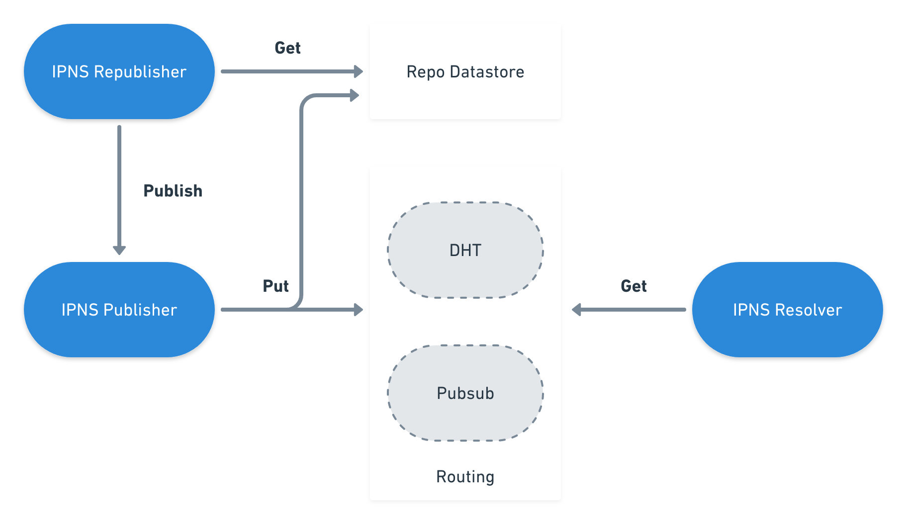

#  IPNS - Inter-Planetary Naming System

**Authors(s)**:
- Vasco Santos ([@vasco-santos](https://github.com/vasco-santos))
- Steven Allen ([@Stebalien](https://github.com/Stebalien))

-----

**Abstract**

IPFS is powered by content-addressed data, which by nature is immutable: changing an object would change its hash, and consequently its address, making it a different object altogether. However, there are several use cases where we benefit from having mutable data. This is where IPNS gets into the equation.

All things considered, the IPFS naming layer is responsible for the creation of:
- mutable pointers to objects
- human-readable names

# Table of Contents

- [Introduction](#introduction)
- [IPNS Record](#ipns-record)
- [Protocol](#protocol)
- [Overview](#overview)
- [API Spec](#api-spec)
- [Integration with IPFS](#integration-with-ipfs)

## Introduction

Each time a file is modified, its content address changes. As a consequence, the address previously used for getting that file needs to be updated by who is using it. As this is not practical, IPNS was created to solve the problem.

IPNS is based on [SFS](http://en.wikipedia.org/wiki/Self-certifying_File_System). It consists of a PKI namespace, where a name is simply the hash of a public key. As a result, whoever controls the private key has full control over the name. Accordingly, records are signed by the private key and then distributed across the network (in IPFS, via the routing system). This is an egalitarian way to assign mutable names on the Internet at large, without any centralization whatsoever, or certificate authorities.

## IPNS Record

An IPNS record is a data structure containing the following fields:

- 1. **Value** (bytes)
  - It can be any path, such as a path to another IPNS record, a `dnslink` path (eg. `/ipns/example.com`) or an IPFS path (eg. `/ipfs/Qm...`)
- 2. **Validity** (bytes)
  - Expiration date of the record using [RFC3339](https://www.ietf.org/rfc/rfc3339.txt) with nanoseconds precision.
  - Note: Currently, the expiration date is the only available type of validity.
- 3. **Validity Type** (uint64)
   - Allows us to define the conditions under which the record is valid.
   - Only supports expiration date with `validityType = 0` for now.
- 4. **Signature** (bytes)
  - Concatenate value, validity field and validity type
  - Sign the concatenation result with the provided private key
  - Note: Once we add new validity types, the signature must be changed. More information on [ipfs/notes#249](https://github.com/ipfs/notes/issues/249)
- 5. **Sequence** (uint64)
  - Represents the current version of the record (starts at 0)
- 6. **Public Key** (bytes)
  - Public key used to sign this record
  - Note: The public key **must** be included if it cannot be extracted from the peer ID (reference [libp2p/specs#100](https://github.com/libp2p/specs/pull/100/files)).
- 7. **ttl** (uint64)
  - A hint for how long the record should be cached before going back to, for instance the DHT, in order to check if it has been updated.

These records are stored locally, as well as spread across the network, in order to be accessible to everyone. For storing this structured data, we use [Protocol Buffers](https://github.com/google/protobuf), which is a language-neutral, platform neutral extensible mechanism for serializing structured data.

```
message IpnsEntry {
	enum ValidityType {
		// setting an EOL says "this record is valid until..."
		EOL = 0;
	}
	required bytes value = 1;
	required bytes signature = 2;

	optional ValidityType validityType = 3;
	optional bytes validity = 4;

	optional uint64 sequence = 5;

	optional uint64 ttl = 6;

	optional bytes pubKey = 7;
}
```

## Protocol

Taking into consideration a p2p network, each peer should be able to publish IPNS records to the network, as well as to resolve the IPNS records published by other peers.

When a node intends to publish a record to the network, an IPNS record needs to be created first. The node needs to have a previously generated asymmetric key pair to create the record according to the datastructure previously specified. It is important pointing out that the record needs to be uniquely identified in the network. As a result, the record identifier should be a hash of the public key used to sign the record.

As an IPNS record may be updated during its lifetime, a versioning related logic is needed during the publish process. As a consequence, the record must be stored locally, in order to enable the publisher to understand which is the most recent record published. Accordingly, before creating the record, the node must verify if a previous version of the record exists, and update the sequence value for the new record being created.

Once the record is created, it is ready to be spread through the network. This way, a peer can use whatever routing system it supports to make the record accessible to the remaining peers of the network.

On the other side, each peer must be able to get a record published by another node. It only needs to have the unique identifier used to publish the record to the network. Taking into account the routing system being used, we may obtain a set of occurrences of the record from the network. In this case, records can be compared using the sequence number, in order to obtain the most recent one.

As soon as the node has the most recent record, the signature and the validity must be verified, in order to conclude that the record is still valid and not compromised.

Finally, the network nodes may also republish their records, so that the records in the network continue to be valid to the other nodes.

## Overview



## API Spec

  - [API_CORE](https://github.com/ipfs/specs/blob/master/API_CORE.md

## Implementations

  - [js-ipfs](https://github.com/ipfs/js-ipfs/tree/master/packages/ipfs-core/src/ipns)
  - [go-namesys](https://github.com/ipfs/go-namesys)

## Integration with IPFS

#### Local record

This record is stored in the peer's repo datastore and contains the **latest** version of the IPNS record published by the provided key. This record is useful for republishing, as well as tracking the sequence number.

**Key format:** `/ipns/base32(<HASH>)`

Note: Base32 according to the [RFC4648](https://tools.ietf.org/html/rfc4648).

#### Routing record

The routing record is spread across the network according to the available routing systems.

**Key format:** `/ipns/BINARY_ID`

The two routing systems currently available in IPFS are the `DHT` and `pubsub`. As the `pubsub` topics must be `utf-8` for interoperability among different implementations
