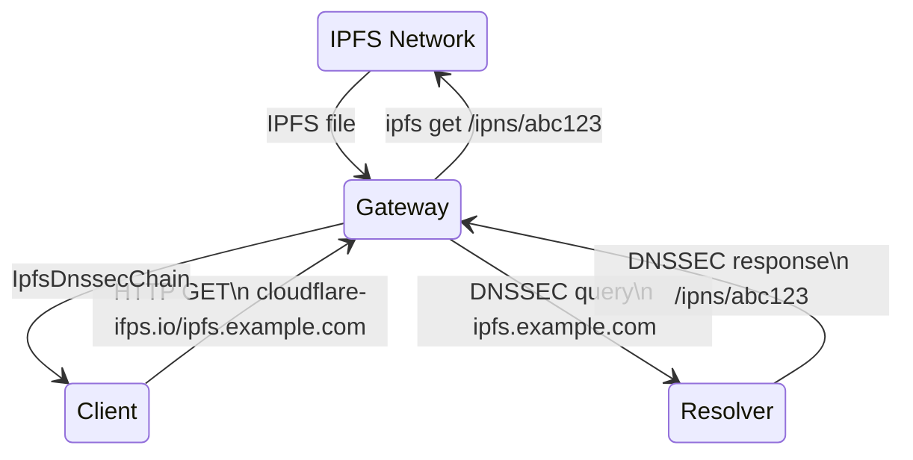
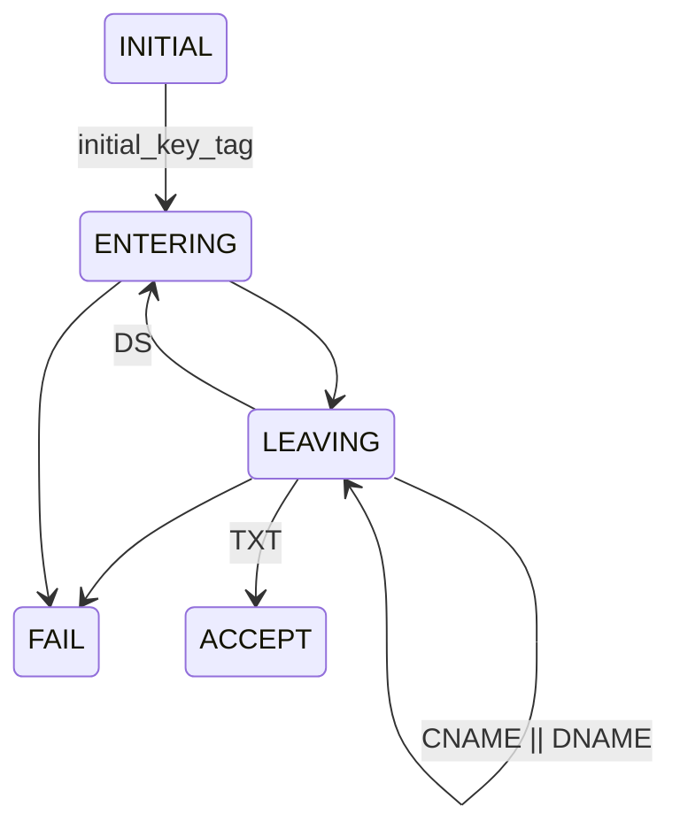
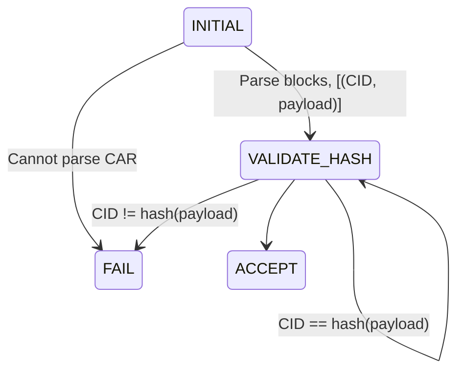

# IPIP 0000: Gateway-provided DNSSEC proofs for DNSLink responses
- Start Date: 2022-07-06
- Related Issues:
  - https://github.com/ipfs/kubo/issues/8799
  - https://github.com/ipfs/kubo/issues/6129

## Summary
IPFS is connected to DNS through a standard called DNSLink. DNSLink allows a DNS TXT record for a domain to point to an IPNS address or IPFS content ID (CID). This specification describes a method for providing proof to the requesting client that the DNS mapping is provided by honest/trusted name servers and that the IPFS address pointed to by the TXT record corresponds to the content received by the client.

This specification consists of four logical pieces.

1. A method for serializing DNSSEC proofs and IPFS CAR files
2. A method for communicating these proofs to the requesting client
3. A method for the client to validate DNSSEC proofs
4. A method for the client to validate the integrity of the IPFS content

## Motivation
In the current gateway, clients are forced to trust the DNS and IPNS resolutions of the gateway. This entails implicit risk for clients who cannot validate if the content they receive is the content bound to the name they requested. This state of affairs can leave clients vulnerable to MitM attacks.

This proposal reduces the trust needed by a client, and allows honest gateways to prove it is responding truthfully.

## Requirements & Assumptions
### Feature Requirements
  1. The proof must be returned in-band with the DNS responses so that the gateway does not need to store state. This is not a hard requirement, but storing state is an engineering challenge that would be nice to avoid.
  2. The proof must be verifiable by a client. This includes not being so large as to cause undue burden on the client.

### Compatibility Requirements
1. Participating clients should still be compatible with non-participating gateways. In other words, a client benefiting from this solution should still be compatible with all gateways that it can presently use.
2. Gateways should maintain compatibility with non-participating clients—those clients will not benefit from the DNSSEC proofs, but they should still have full access to data.
3. Gateways should not rely on any specific public DNS resolver, i.e., the implementation should be resolver agnostic.

### Security Considerations
1. DNSSEC responses can be much larger that vanilla DNS responses, in theory, this could be a vector for DDoS amplification.

### Assumptions on Scope
1. We consider only IPFS blocks bound to DNS with DNSLink. This is without loss of generality, because an IPFS subgraph referenced by its root hash is directly verifiable by confirming the hashes and thus would not benefit from the DNSSEC proof.
2. For non-existent URLs, we will not walk the zone (through NSEC records). Including the walkthrough would dramatically increase the proof size. In other words, we will only offer verifiable proof for positive responses.
3. We will not support wildcards in DNS resolution. This is not a problem because our target subdomains will always begin with "\_dnslink", and domains cannot have wildcards in the middle.
4. We will not support multiple root Key Signing Keys or changed Key Signing Keys in this version.

### Assumptions on resource usage
1. Informal experiments have shown that chains of DNSSEC responses are between 2-4 KB. This includes denial-of-existence proofs, even in zones that are known to have high DNSSEC adoption (where proofs can be larger).

## Threat Model
- DNS name servers are trusted to provide honest mappings.
- A resolver may attempt to break the chain of trust.
- Cryptographic primitives are assumed to be secure.
- A gateway can attempt provide either a false DNSSEC proof or incorrect IPFS content and is therefore untrusted.

## Detailed Design
### Components
1. HTTPS-capable client (likely in a browser)
2. IPFS gateway
3. Recursive resolver
4. IPFS network

### How do the components work together
1. Client establishes a TLS connection to the gateway and sends a HTTP request to the IPFS gateway with header "Accept: application/vnd.ipld.namedcar" using a Reduced TLS DNSSEC Chain Extension (see below)
2. Gateway queries recursive resolver for DNSSEC chain and DNS resolution, which should yield an IPFS content name (from a DNSLink)
3. Gateway requests CAR of content from IPFS network
4. Gateway returns IpfsDnssecChain (see data model) to client and also caches for future requests.



            
### Reduced TLS DNSSEC Chain Extension
The protocol, as defined in [RFC 9102](https://datatracker.ietf.org/doc/html/rfc9102), is overkill for our use case. We do not require the chain of authentication (TLSA records and signatures), only the chain of DNSSEC signatures. This proposed extension would entail reusing the RFC, but cutting out any TLSA bits. The details of this serialization are detailed below.

### DNSSEC Proof Validation

We describe the proof validation process as a finite state machine, taking inspiration from the RFC draft: Serializing DNS Records with DNSSEC Authentication. The naming terminology (e.g. ENTERING, LEAVING) describes the traversal of zones during validation. Each zone has a name and during validation we track a set of trusted keys for each zone that we store in a stack of zones. For field names, see Data Model. We assume that the validator knows the target domain they are attempting to access, we refer to this as target.

The protocol begins in the INITIAL state. The validator will have received an initial\_key\_tag (see RFC 4034) from the gateway. The validator uses this to confirm that it is using the correct initial key. For version 1, we are using zero to indicate that we're using the root zone's public Key Signing Key (KSK), and not supporting any other roots of trust. Non-zero values should prompt a failure. The root zone's KSK is trusted by default. Subsequently, the protocol moves to the ENTERING state. 

In the ENTERING state, the validator reads the next unread Entering. The validator then assembles the Entering's keys in canonical form using canonical ordering (RFC 4035, Section 5.3.2). Then the validator checks the signature on the current Entering's key set using the trusted KSK for the current zone. This will either be the root zone's KSK, or a KSK check against a DS in the previous LEAVING state. If the check succeeds, the entire key set can be trusted for the current zone. The validator then extracts the Key corresponding to the entry\_key\_index, and confirms that bit 7 is set indicating that this is a Zone Signing Key (ZSK) and fails otherwise. Then the protocol moves into the LEAVING state.

The LEAVING state begins by reading the next unread Leaving struct. There are four possible types of Leaving structs: CNAMEs, DNAMEs, DSs, and defaults. If the RRType is anything except DS, CNAME, or DNAME, the validator assembles the RRDATA in canonical form and in canonical ordering (the same way as was done in ENTERING). It then checks it against the signature in Signature using the trusted ZSK (the entry key) for the current zone. If the signatures do not match, the protocol fails. Otherwise, if next\_name matches target, validation has been successful. The final text record must be at a subdomain that begins with "_dnslink" according to the DNSLink standard. Since we have a hard constraint on the beginning of the domain, we will not support wildcards, which cannot occur in the middle of a domain. The protocol moves to ACCEPT.

Within the LEAVING state, if the RRType is DS, the validator must check that there is at least one record in ds\_records where the digest equals the hash of the KSK in the subsequent Entering struct. The validator then checks that the next\_name has a longer matching prefix[^1] with the target than the current zone. The protocol then moves back to ENTERING. If the RRType is CNAME, the validator must confirm that next\_name matches target, and fail otherwise. This must be the case because a CNAME can only be used at the leaf subdomain in the DNS tree hierarchy. If next\_name does match target, then name becomes the new target. We pop zones off the stack until the new target is within the topmost zone the reenter the LEAVING state. If the RRType is DNAME, the validator must confirm that next\_name is a super-domain of target, and fail otherwise. If next\_name is a super-domain of target, then the next\_name suffix in target is replaced by name. We then pop zones off the stack until the new target is within the topmost zone and then reenter the LEAVING state. This method supports DNAME chaining.

[^1] A longer match in terms of number of subdomains/domains.



### CAR File Validation
This can be done in parallel with the DNSSEC proof validation. We again describe the procedure in terms of a finite state machine. Note that the CAR format supports any hash algorithm that can be encoded in the multihash format. For version 1, we will only support a few common algorithms (e.g., SHA256)—this should not cause any compatibility issues, since the gateway is requesting the CAR file (and thus declaring what hash algorithm the CAR should use).


Validation begins in the INITIAL state. Upon reading the CAR header, we extract the CIDs and payloads of each block in the CAR (stored in a list), then enter the VALIDATE\_HASH state. In VALIDATE\_HASH, we check that the client has support for the hash formats and codecs of the current block (and fail if not). We then hash the block payload and check that it matches the CID. If they do not match, validation fails. If they do match, we move to the next block in the list and reenter the VALIDATE\_HASH state. If there are no more blocks, transition to ACCEPT.



For the client implementation, we will prefer to use an available library. Both Go and JS libraries are available (i.e., go-car and js-car). If we opt for the browser extension design, the JS library is probably the best option.

### Alternative Design
For each request, the gateway would respond with an additional header of the form X-Ipfs-Name-Proof: <CID>, where <CID> is a pointer to an IPFS file containing the DNSSEC proof. A client could then retrieve this proof directly from IPFS if they want it. However, we decided against this approach for several reasons. The main reason is that it is never more advantageous for the gateway to retrieve the DNSSEC proof from IPFS than it would be to get it from a local cache. The only time this would be useful is if a gateway could use DNSSEC proofs found by other gateways. This is not feasible because the DNSSEC proof would be stored according to its hash (in IPFS), and the hash required can only be known by already collecting the DNSSEC proof—therefore it would be pointless for a gateway to request content that, by definition, it already has. An additional problem is that DNSSEC proofs have TTLs, and thus will not usually be valid for more than an hour. This limits the time that the content would be useful anyway.


## Data Model
In this section we define the data model and structures that define the serialization format. All data will be serialized in the order specified in the following structs, without padding. All multi-byte integers are encoded big-endian. The top-level structure is IpfsDnssecChain, all data necessary for a client to validate the resolution's correctness is nested within this structure.

```c
struct IpfsDnssecChain {
  uint8 version;
  DnssecProof proof;
  Car ipfsData;
}
```

Note that simply including both the DNSSEC chain and the IPFS CAR in the response is sufficiently strong binding for this use case. This is because the last entry in the DNSSEC chain will include a signed DNSLink record, which validates the IPFS root hash, meanwhile, the client can directly confirm that that CAR is correct by hashing.

The following structures are for serializing IPFS files. In Car, the pragma field is a series of "magic bytes" that indicates the format version (we will support version 2, the latest, which is compatible with version 1). Version 2 gives us more flexibility for indexing the payload than with version 1, which does not natively support indexing. Though, for the first version, we will likely not need indexing. Version 2 is a wrapper around the entire version 1 archive.

```c
struct Car {
  bytes pragma[11];
  CarHeaderV2 head;
  CarV1 data;
  IndexPayload index;
}
 
struct CarHeaderV2 {
  byte characteristics[16];
  byte dataOffset[8];
  byte dataSize[8];
  byte indexOffset[8];
}
 
struct IndexPayload {
  uint32 length;
  bytes payload[length];
}
```

CarHeaderV1 is encoded in DAG-CBOR per the IPLD spec. The type varint is an alias for an unsigned LEB128 integer.

```c
struct CarV1 {
  CarHeaderV1 head;  
  CarBlockV1 blocks[];
}
 
struct CarHeaderV1 {
  varint version; // will always be 1
}
 
struct CarBlockV1 {
  varint length;
  Cid root;
  byte data[];
}
 
struct Cid {
  byte address[];
}
```

For version 1, we will only support the initial\_key\_tag pointing to the root zone's public key. A value of zero for initial\_key\_tag will confirm this. Non-zero values will cause the verifier to reject the proof. The array of ZonePairs should be in order from the root zone, down to the zone hosting the record of the initial request. Every ZonePair must have a valid Leaving, but need not contain an Entering (the reason for this becomes clear when we discuss CNAMEs and DNAMEs during validation).

```c
struct DnssecProof {
  uint16 initial_key_tag;
  uint8 num_zones;
  ZonePair zones[num_zones];
}
 
struct ZonePair {
  Entering entering;
  Leaving leaving;
}
 
enum ZoneRecType {
  ENTERING = 0;
  LEAVING = 1;
}
```

The entry\_key\_index corresponds to a key in keys. In the initial zone (i.e. root zone), the entry key will have length zero. If it is non-zero, this should prompt failure until non-root zone trust anchors are supported. The signature is over the key set (both ZSKs and KSKs) at the present zone.

```c
struct Entering {
  uint16 length;
  ZoneRecType type;
  uint8 entry_key_index;
  struct Signature key_sig;
  uint8 num_keys;
  struct Key keys[num_keys];
}
```

Resource records should be ordered as in RFC 4034 (Section 6.3). The next_name field stores the name of the next zone in the validation.

```c
struct Leaving {
  uint16 length;
  ZoneRecType type;   
  string next_name;
  RRType rrtype;
  struct Signature rrsig;
 
  select (rrtype) {
    case CNAME:
      Name name;
    case DNAME:
      Name name;
    case DS:
      uint8 num_ds;
      struct Ds ds_records[num_ds];
    default:
      uint8 num_rrs;
      struct RRData rrs[num_rrs];
    }
  }
}
 
enum RRType {
  NS = 0,
  DNSKEY = 1,
  RRSIG = 2,
  DS = 3,
  CNAME = 4,
  DNAME = 5,
  TXT = 6
}
 
struct RRData {
  uint16 length;
  byte rrdata[length];
}
```

Keys are formatted exactly as in RFC 4034 (Section 2.1), and ordered as in Section 6.3.

```c
struct Key {
  uint16 length;
  Dnskey_Rdata rdata[length];
}
 
struct Dnskey_Rdata {
  uint16 flags;
  uint8 protocol;
  uinit8 algorithm;
  byte public_key[];
}
```

This struct represents the signature and associated metadata.


```c
struct Signature {
  uint16 length;
  uint8 algorithm;
  uint8 labels;
  uint32 ttl;
  uint32 expires;
  uint32 begins;
  uint16 key_tag;
  byte signature[length - 16];
}
```

This struct holds the data needed to validate DS records. This format is the same as described in RFC 4034 (Section 5.1). According to [Serializing DNS Records with DNSSEC Authentication](https://www.ietf.org/archive/id/draft-agl-dane-serializechain-01.html#rfc.section.3), key\_tag and algorithm are redundant. However, inferring both of these increases complexity, so we will include them explicitly in version 1.

```c
struct Ds {
  uint16 key_tag;
  uint8 algorithm;
  uint8 digest_type;
  uint16 digest_len;
  byte digest[digest_len];
}
```

### Security 
DDoS Amplification: For each request to the gateway, a request must be made to the resolver and to IPFS, leading to several server-side computations. However, This information is cacheable, which should reduce the risk.


## Open Problems
The DNS query (via DNSLink) will often not resolve to a CID. It may resolve to either a CID with a subresource (e.g. /ipfs/QmYwAPJzv5CZsnA625s3Xf2nemtYgPpHdWEz79ojWnPbdG/readme) or it may resolve to an IPNS name (e.g. /ipns/QmSrPmbaUKA3ZodhzPWZnpFgcPMFWF4QsxXbkWfEptTBJd). Regarding subresources: our choice is either to have the client do the recursive resolution, or do the resolution on the server side. As the point of this spec is to avoid client side DNSSEC resolutions, it would probably make more sense to go with the second approach. However, this second approach may involve adding new headers to the CAR.

Regarding IPNS names: we can most likely serialize the IPNS proof using similar techniques as described above.


## Copyright
Copyright and related rights waived via [CC0](https://creativecommons.org/publicdomain/zero/1.0/).
