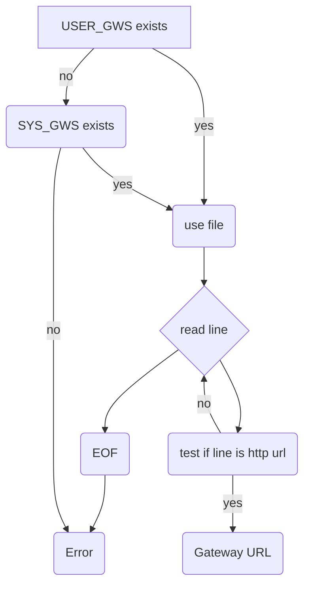

# IPIP-0000: Gateways file integration

- Start Date: 2022-12-17
- Related Issues:
  - None
- Relies on specs:
  - IPIP-0280

## Summary

A companion spec to IPIP-0280 detailing how an integration, an application wanting to support the IPFS protocol, can find a gateway to use.

## Motivation

For consistent behavior across applications it is strongly adviced to consider using a `multi gateway client` implementation instead!

An application that wants to integrate IPFS support but can't use a `multi gateway client` implementation needs to know a gateway to make their own flavor of IPFS integration.

## Detailed design

IPIP-0280 defines 2 locations for the `gateways` file. Both of these locations could contain gateway URLs to use.

1. User `gateways` file, shown in the below diagram as `USER_GWS`
2. System wide `gateways` file, shown in the below diagram as `SYS_GWS`

Consult IPIP-0280 to find the exactlocations of those files.

You have a gateway ready to use when you end at `Gateway URL`. You can use it in the following format: `<gateway>/<protocol>/<cid>`. An actual example would look like this: `http://localhost:8080/ipfs/bafybeigagd5nmnn2iys2f3doro7ydrevyr2mzarwidgadawmamiteydbzi`

If you end up in the `Error` case you should notify the user that no gateway could be found.

From this point on you can implement IPFS handling with the found gateway. It is advised to follow the principles in `multi gateway client` to offer comparable features and comparable resiliancy with the help of multiple gateways!

## Test fixtures

N/A

## Design rationale

### User benefit

Allows for flexible broad IPFS integration. For end users this allows for more places where IPFS is supported out of the box.

### Compatibility

Kubo currently makes `$HOME/.ipfs/gateway` with only it's gateway. This file is there for historical compatibility purposes. You can opt to check this file too.

### Security

N/A

### Alternatives

N/A

### Copyright

Copyright and related rights waived via [CC0](https://creativecommons.org/publicdomain/zero/1.0/).
