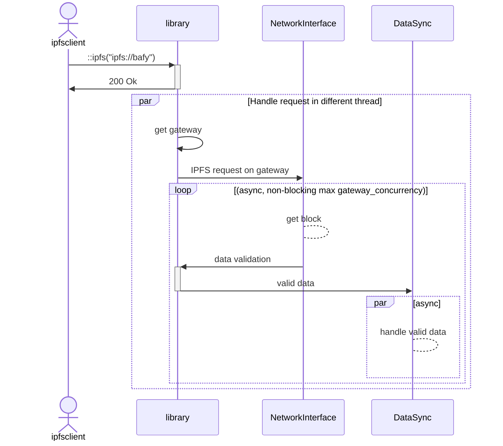

# IPIP 0000: IPFSClient API

- Start Date: 2022-12-12
- Related Issues:
  - None

## Summary

Describes how to implement IPFS in a decentralized way with only gateways over HTTP.

## Motivation

There is a need for places that can't quite run full IPFS nodes to still have a great IPFS experience. This could be a multitude of reasons (like constrained network resources, lower powered hardware, etc...). Using a gateway one can already IPFS content in a read-only manner, which is enough for many usecases. With mutiple gateways this approach becomes very distributed.

This IPIP defines the set of interface functions required to be able to access IPFS in this decentralized way through only gateways.

Do note that this is a 2-step implementation approach.

1. This IPIP merely defines the interface that some future library should expose. For simplicity, we call this "the library" or "library" in the other parts of this document.
2. Another application could then use the library from point 1 to create and actual "ipfsclient" application. This could for example be a stand-alone application but could also be browser integration or anything in between. For simplicity, we call this the "ipfsclient" or "client application".

## Detailed design

The following is a [WebIDL](https://en.wikipedia.org/wiki/Web_IDL) like attempt to describe the API. WebIDL and non-web programming doesn't fully map hence the very detailed description below it.

```idl=
  enum ErrorType
  {
    IO,
    WEB
  }

  interface Error
  {
    required long error_code;
    required ErrorType error_type;
    required String descriptive_message;

    required long code(ErrorType error_type);
  }

  interface Url
  {
    String url;
    bool is_valid;
    bool _validate_url();
  }

  typedef String CID;

  interface NetworkInterface
  {
    required async <Error, sequence<byte>> get_http_data(CID cid, &Url http_url);
    required async Error done(CID cid);
    required async void cancel(CID cid);
  }

  interface DataSync
  {
    required async Error data(CID cid, sequence<byte> buffer);
    required async void done(CID cid);
    required async void error(CID cid);
  }

  interface Api
  {
    NetworkInterface network_interface;
    DataSync data_sync;
    sequence<Url> gateways;
    long gateway_concurrency;
    long max_simultaneous_cids;
    long max_total_simultaneous_gateways;

    required Error ipfs(&Url ipfs_url);
    required <Error, Url> random_gateway(&Url ipfs_url);
    required String id();
  }
```

Notes with regards to the syntax:

1. `required` here is intended to mean that the user of said function is required to check it's return value.
2. The `_validate_url` is intended to be a private function that should be an implementation detail.
3. Arguments are written in the C-family way of writing function arguments. So `type name` like `int value`.
4. `async` here means that the function itself runs async.

### Flow
The next chapters will describe the above api in full detail. The flow here serves as an illustrative example to demonstrate the conceptual workings.



### enum ErrorType

This enum specifies the different kinds of errors that can be represented. An `IO` error means the error code is related to writing a file and the code maps to [POSIX](https://pubs.opengroup.org/onlinepubs/9699919799/basedefs/errno.h.html) error codes.

`WEB` arrors are errors that map to the [HTTP status codes](https://en.wikipedia.org/wiki/List_of_HTTP_status_codes) and apply to executing an URL.

### interface Error

The error interface has 3 members that all must be filled in with a value.
For `error_code` and `error_type`, see the above explenation of the `ErrorType` enum.

The `descriptive_message` should contain a descriptive message applicable to the error. So for example if the `error_type` is `WEB`, the `error_code` is `404` then the error message should be `Not found.`

The OK condition (meaning all went well, done without errors) of the `Error` object is different depending on the context.
For `IO` it can be considered OK when the code is `0` and the `descriptive_message` is empty.

For `WEB` it must be the `200` code with `OK` as descriptive message.

#### `required long code(ErrorType error_type);`

**Description**
This `code` function is a required convenience function. It's existence allows code to be written like:
```cpp
while (error.code(WEB).error_code != 200)
{
  // get data
}
```

Without this convenience wrapper you'd have to manually check if the type is `WEB` (in this example case) that can now be abstracted awar in the `error` function itself.

This function can return `-1` which means `Provided error_code doesn't match object error_code`. That should only happen when checking for a `WEB` error while the object contains an `IO` error or vice verse.

**Parameters**
`ErrorType error_type` the type of error according to the enum `ErrorType`.

**Return**
Returns the `error_code` value if the provided `error_type` matches the `error_type in the object`. Else returns -1.

### interface Url

The Url object will contain 1 URL that is schema valid for the URL structure. Libraries and tools often already have a Url class that does this for you. Rust for example has the Url class too that should be used in this context. In C++ land with Qt as framework, there is the QUrl class to allow URL validation.

If your toolset of use has a Url class that has build-in URL validation support, use that instead.

If your tool doesn't have it then create and Url class that does Url validation where at least http gateway URL's (`http://...`) and IPFS url's (`ipfs://...`) are considered valid. Within the context of this library, those are enough. The url - valid or not - must be stored in the `url` member variable. The result of a validation (handled by an internal function) must be stored in the `is_valid` member variable.

### typedef String CID

Parts of this spec will refer to `CID`. For clarity it's named as that type, it's implementation can just be a string.

### interface NetworkInterface

The network interface API is intended to be an interface to the API. It's implementation must come from the client application. The reasoning here is that each application implementing this API and/or the client application likely has their own network functionality already that should be reused for handing network traffic.

An example of how these functions are to be used from an API point fo view is as follows:

```cpp=
// client side
API api
NetworkInterface network_interface;
DataSync data_sync;
api.network_interface = network_interface;
api.ipfs("ipfs://bafyA")

// api side
while (network_interface.done("ipfs://bafyA").code(WEB) != 200)
{
  auto [error, data] = get_http_data(&Url http_url);
  if (error.error_code != 1)
  {
    // print error
  }
  else
  {
    // do something with the data and send it to the client side
  }
}
```

The below details to implement this interface are for the client implementation ony. The API implementations can ignore this part.

#### `required async <Error, sequence<byte>> get_http_data(CID cid, &Url http_url);`

**Description**
This function will be implemented on the client side and do the actual network requests. The client side is in full control of how it wants to implement the handling of the URL. A client implementation should be aware that this function might be called multiple times with the same `CID` but a different `Url` (the Url contians the CID too). The client should interpret this scenaria on one of 2 ways:

1. The client downloads whole files, no chunking involved. If a client receives a `CID` multiple times, each with a different gateway, then the file as a whole must be downloaded from multiple gateways. The data from the gateway that had send it fastest must be send back to the library with all other requests of the same `CID` being cancelled and ignored. This is the more bandwidth intensive way because of N request only 1 will be used.
2. The client downloads in chunks. If a client receives a `CID` multiple times, each with a different gateway, then the client shall download each individual chunk with a different gateway. Which chunk the current request shall download is bookkeeping specific to this variant of getting data. Upon completion of each chunk, it's blob must be send back to the library.

The library will call this function in an async matter. This will be up to the number defined in `Api.gateway_concurrency`. That effectively defines how many different gateways will potentially be used.

**Parameters**
`CID cid` is the `CID` we want to get the date from. Note that in multiple requests for the same `CID` this value will remain the same. The `http_url` will differ.

`&Url http_url` is the `ipfs://<cid>` translated to already a random gateway in the format of `<gateway>/ipfs/<cid>` (or ipns) which could look like `https://localhost:8080/ipfs/<cid>`.

**Return**
The return type is a pair where the first value is the `Error` object with an appropiate error if any. The `Error.error_code` must be `200` when there is no error and the download completed. The second return argument must be the raw data! While you, as the client, do see the raw data, you should not use it! The library side will handle the raw data and do data validation.

#### `required async Error done(CID cid);`

**Description**
This function is called in a loop by the library side. It's being used to check if there is more data to be downloaded from a given IPFS request. The client side should maintain a sort of mapping to CID -> how much data to download -> how much is downloaded. This function must return an error value indicating the download is completed `(200 Ok)`. While that is not the case it should return a value `(206 Partial Content)` indicating there is potentially still more data to download.

**Parameters**
`CID cid` is the `CID` for which we want to know if it's done handling all the data.

**Return**
Returns an `Error` object with the status of the download.

#### `required async void cancel(CID cid);`

**Description**
The cancel function must be implemented by the client and be able to stop a running `get_http_data` request. The client does **not** call this function! The library, upon receiving an `error` or the result of `get_http_data` will determine if any of it's requests are still pending a return and will call `cancel` on those applicable.

**Parameters**
`CID cid` the CID fow which we want to cancel all pending requests.


### interface DataSync
If we take the earlier example
```cpp=
// client side
API api
NetworkInterface network_interface;
DataSync data_sync;
api.network_interface = network_interface;
api.ipfs("ipfs://bafyA")

// api side
while (network_interface.done("ipfs://bafyA").code(WEB) != 200)
{
  auto [error, data] = get_http_data(&Url http_url);
  if (error.error_code != 1)
  {
    // print error
  }
  else
  {
    // verify data (both CAR and non-CAR), "DataVerification(...)" is a hypothetical class to ilustrate the purpose
    if (DataVerification(data) == true)
    {
      // send verified data back to client
      data_sync.data("ipfs://bafyA", data);
    }
    else
    {
      // verification error, malicious data or whatever other reason
      data_sync.error("ipfs://bafyA");
    }
  }
}
```

We can now see that the intent for the `DataSync` is to handle verified data. The library will do the verification of this data. Id there is an error the client will only be notified of an error in the data, not what the error is. The library might or might not expose more details of this error.

#### `required async Error data(CID cid, sequence<byte> buffer);`

**Description**
This function get called on the library side when data validation succeeded. The client side in it's implementation of this function is responsible for handling this now verified data. Depending on the purpose of the client this can mean different things. In for example a IFFS client downloading application this function would store this data in a file that is going to represent `cid`.

**Parameters**
`CID cid` the `CID` for which we're receiving verified data.
`sequence<byte> buffer` the verified byte array of data to handle.

**Return**
The return must be an `IO` typed `Error` object with code `0` is there is no error. Or an applicable [POSIX](https://pubs.opengroup.org/onlinepubs/9699919799/basedefs/errno.h.html) error is there is an error.

#### `required async void done(CID cid);`

**Description**
This function tells of all the data is processed on the **library** side. Due to the logic the library should use, this must also mean that the client had received the last `data(cid, buffer)` to complete handling the given `cid`. Depending on the client usecase this function might or might not be useful. If the client rwites `data(...)` output to files then this function should be used to close the file.

Within the `DataSync` object the `done` and `error` functions are mutually exclusive! If one is received the other must nbever be triggered for the same `cid`.

**Parameters**
`CID cid` the `cid` that is now done processing.

#### `required async void error(CID cid);`

**Description**
The error function is only tells the client that the library encountered an error while processing data. This could for example be a failed verification. On the client side you don't get to know what the error is only that there was an error. On the library side the error is known.

The client implementation should abort and data handling for `cid`.
The error function can only be called if `done` wasn't called.

Within the `DataSync` object the `done` and `error` functions are mutually exclusive! If one is received the other must nbever be triggered for the same `cid`.

**Parameters**
`CID cid` the `cid` that had an error while processing it's data on the library side.

### Api

The `Api` object is the object the client needs to instantiate to do IPFS requests.

#### `NetworkInterface network_interface;`

**Description**
The client must provide an implementation of the `NetworkInterface` interface. This could for example be handled on the client side with a network stack already available in the context of the application.

This implementation has to be assigned to the `network_interface` variable.

#### `DataSync data_sync;`

**Description**
This description is from before 12-12-2022. Refer to [this](#12-12-2022) note to see what changed.

The client must provide an implementation of the `DataSync` interface. Whn data is downloaded it's verified too, after this verification step the data is send back the the client though the `DataSync` interface. This allows you to threat the data as verified and handle it however you seem fit. It could for example be to store as a file.

#### `sequence<Url> gateways;`

**Description**
For a detailed description see IPIP-AAAA that details how multiclient gateways are found and maintained.

This variable effectively stores all potential gateways that can be used.
If you want to be in control of this yourself then you have to initialize this variable with a non-empty list of gateways (could just be one) which will always use what you provided and not try anything on it's own with managing gateways.

#### `long gateway_concurrency;`

**Description**
This variable determines the maximum amount of gateways to be used to handle an IPFS request. A sane default would be 5.

You can compare this variable with download clients and how many threads a client uses to download the same file. Just in IPFS speak that is now gateways as opposed to threads.

### `long max_simultaneous_cids;`

**Description**
This variable determines the maximum number om simultaneous - but different CIDs - to handle at any time. A CID here is determined by what it put in with the `ipfs(...)` function. The seperate chunks - or blocks - the CID is represented by all count as 1 CID handling.

You do need to be aware that the number of gateway connections goes up exponentially the more simultaneous CIDs you want to handle. To give an example calculation:
```cpp=
  // ...
  long gateway_concurrency = 10;
  long max_simultaneous_cids = 5;
  long potential_max_connections = gateway_concurrency * max_simultaneous_cids;

  // so 50 in this example
```

You can also compare this with download clients where you can download a maximum of N files at the same time.

#### `long max_total_simultaneous_gateways;`

**Description**
In the example of `max_simultaneous_cids` you can see that fairly trivial defaults could quickly mean a lot of open http connections.

This variable, `max_total_simultaneous_gateways`, exists to put an upper bould limit on these connections. Say your upper limit is 25 connections but you still want to have the same settings as above (5 http connections per each CID to be handled through the `ipfs(...)` function).

If you run the following with 2 requests you could get this:

```cpp=
  API api;
  api.max_total_simultaneous_gateways = 25;
  // ...
  api.ipfs("ipfs://bafyA"); // 10 http connections
  api.ipfs("ipfs://bafyB"); // 10 http connections
```

That example is within all set bounds.
If you run more requests, say 4, then you're well above your `max_total_simultaneous_gateways` of 25.
The logic behind the `ipfs(...)` function must detect this and spread the available maximum connections over the requests. So with 4 requests this would look like:

```cpp=
  API api;
  api.max_total_simultaneous_gateways = 25;
  // ...
  api.ipfs("ipfs://bafyA"); // 7 http connections
  api.ipfs("ipfs://bafyB"); // 6 http connections
  api.ipfs("ipfs://bafyC"); // 6 http connections
  api.ipfs("ipfs://bafyD"); // 6 http connections
```

It should simply do a sum like `max_total_simultaneous_gateways / num_of_requests` (25 / 4) which would be 6.25. That should be round down to 6.

Next it should check to see if the new total connections used (6 * 4 = 24) is smaller then the `max_total_simultaneous_gateways`. That difference, 1 in this case, should be used in the first active connection that doesn't yet meet the `gateway_concurrency` maximum. This should end up in connections being spread as evenly as possible among requests.

There could also be the case, in this same example, where 2 requests where started early and already each have 10 http connections allocated to them. When a 3rd request comes in the connections should already be re-balanced. Same with a 4th connection. Internally it is calculated how many connections each request can have (6 for each with one of 7). It will then ask those requests that currently have too many connections to release some of their connection slots as soon as their current chunk/block handling is processed. This is gracefully handing over connection slots to other requests to even things out.

A connection in this mechanism is **never** canceled!

A proper implementation would be for each request to check on a per connection base (which is per block it downloads) to see if it can proceed onto the next block or if it needs to wait in line for the next connection.

#### `required Error ipfs(&Url ipfs_url);`

**Description**
This function triggers the whole flow of getting data from IPFS.
Initially each request that is received in this function is internally put on a queue of requests to handle. If the entry can be handled immediately a `200` status code is returned from this function. A `202` code is returned if the request cannot be handled just yet and remains on the queue.

**Parameters**
`&Url ipfs_url` this is the `ipfs://...` or `ipns://...` url which needs to be handled.

**Return**
Returns an error object with a `WEB` status code. This code will be `202` with the description being `Accepted` when the library can handle the request but not "immediately". You could consider this to be notification that the request is pending in the queue to be handled.

If the request can be handled immediately the response `WEB` code will be `200` with the description being `Ok`. This means your `NetworkInterface` implementation will now get subsequent requests to handle data blobs for the `ipfs_url` you provided.

#### `required <Error, Url> random_gateway(&Url ipfs_url);`

**Description**
This is a convenience function for the client. The client implements the network functionality (`NetowrkInterface`) and might choose to do all the block handling in there. In such an example the client has the option to request a new random gateway to handle that request.

This is to offer flexibility. It would be better to let the client handle data in a blocksize manner and return that data to the library. The library then gives you a new request for the next block with a different gateway too.

**Parameters**
`&Url ipfs_url` this is the `ipfs://...` url for which you will get a potentially different gateway for each time you call this function. Note that this heavily depends on the number of gateways available.

**Return**
Returns a gateway url in the format `<gateway>/<protocol>/<cid>` so like `http://localhost:8080/ipfs/bafy...`. In the event of no gateways an error will be returned of the `WEB` type with `503` as code and `Service Unavailable` as description.

#### `required String id();`

**Description**
An implementation must combine a bunch of variables to form a unique string akin to the user-agent string.

The implementation should combine the following:
* IPIP spec number of this spec along with a version. Example: IPIP-0288-V1
* gateway_concurrency
* max_simultaneous_cids
* max_total_simultaneous_gateways

It must be formatted like this in the order of the above:
`IPIP-0288-V1,10,5,25`

Comma seperated without trailing comma nor space.

This ID should be send along with the request to the HTTP gateway in the - for now - `IPFS-AGENT` header.

**Parameters**
None

**Return**
A string in the specified format.

## Conceptual changes and reasons

### 12-12-2022

After a quick meeting with Lidel and Dietrich we seemed to come to the conclusion - for the DataSync class - that any CID -> gateway mapping need on the client side should not be needed. Before this the thinking was as follows. The library would need to know a list of CID -> gateway mappings just to maintain a list of commands to potentially cancel if one of the requests were to fail. The client would also need to maintain a list of the same CID -> gateway mapping for it to later use to construct a file with the incoming verified blocks of data. This line of thinking is now changed to: the client needs no mapping! The effect is that the DataSync class is now implemented on the library side, not on the client side.

We also made up the idea of adding a uniquely identifying sting. The reasoning here is to be able to detect (on the webserver side) if a connection came from an in-browser node (like brave) or from a custom ipfs download client, etc... It's conceptually similar to the user-agent, it should probably be added in the user agent in some form too.

## Open questions

1. The API is async in nature. Should there be a `Error status(&Url ipfs_url)` function that gives back the last known status for a given CID? For example, calling `API::ipfs(...)` could return`200` but also `202` and while requesting data individual data requests likely will return `206 Partial Content`. A status function providing the last known status and details about it's fetched content might make sense. This could potentially be used for progressbar purposes?
2. For the `id()` function. It's still to be determined how this ID is going to look like exactly and how it's going to be send along with each request. It could be a modified user-agent header, it could also be a specific IPFS header (ipfs-agent perhaps?).
