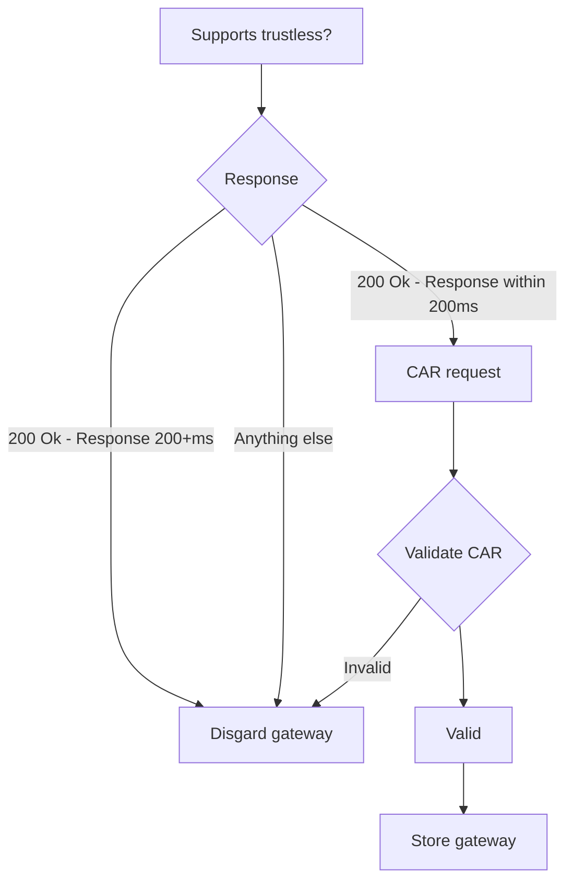

# IPIP-359: Multi gateway client

- Start Date: 2022-12-16
- Related Issues:
  - https://github.com/ipfs/specs/pull/359
- Relies on specs:
  - IPIP-0280

## Summary

A defined way for getting a list of usable gateways.

## Motivation

When developing an application with IPFS functionality you'd ideally want more then 1 gateway and distribute the requests among N gateways. This spec relies on IPIP-0280 (gateways file).

## Detailed design

The starting point for any application wanting to use this spec is to first take care of the the `gateways` file (IPIP-0280). That file must either exist already, meaning that there is an IPFS implementation running that exposes it's gateway in that file. Or the implementer of this spec must, through other means, fill that file with 1 or more gateways (the more the better).

The assumption beyond this point is that there is a gateways file and it contains 1 or more gateways.

### Finding new gateways

The `gateways` file is parsed to know the initial - bootstrap - gateways. Each line in this file is a single gateway. This list of gateways should be stored internally in this `multi gateway client` implementation.

Your internal gateway list might now look like:

```
http://localhost:8080
https://ipfs.io
```

From this point on the client should iterate over those gateways and request each of them to give a list of [gateways that it knows](#Gateway-returns-list-of-gateways-it-knows). Based on the return, this should result in a vastly bigger list of potentially usable gateways:

```
http://localhost:8080
N+1
N+2
...
https://ipfs.io
N+1
N+2
...
```

Important to note here is that this request for more gateways will only be done on the initial list of provided gateways! It's non-recursive and therefore won't be executed on newly found gateways.

### Validating gateways to be potentially used

Each gateway will be tasked to execute a query. The results of this query and the time it took determine if a gateway can potentially be used. A hard requirement for a gateway is to support [trustless](https://docs.ipfs.tech/reference/http/gateway/#trusted-vs-trustless) data retrieval!



The `200ms` threshold here is arbitrarily picked. From a decentralized point of view, 200ms allows you to go roughly halfway across the globe assuming your internet connection is stable. From a data retrieval point of view 200ms can be slow but can be just fine too. For example, if a site loads with 1 connection at a time with each connection having a 200ms latency then you will experience that site to "load slow". But if you load the same site with multiple concurrent connections where "some" might hit the 200ms threshold then you won't see much difference.

Once a gateway, in the above flow, reaches the `Store gateway` point then it should internally in this `multi gateway client` implementation be stored in some array.

### Keeping the usable gateway list fresh in the background

Getting this list of gateways and maintaining if they should be used can take quite some time. The adviced approach here is to run each request in an async matter where the async flow follows the same flow as the above flowchart.

### Configuration options

`concurrent requests` Defaults to 10. There must be a way to specify how many concurrent requests the `multi gateway client` does per IPFS request.

`max simultaneous cids` Defaults to 5. There must be a way to define how many simultaneous IPFS requests the `multi gateway client` can handle at any given time.

`max total gateways in use` Defaults to 25. There must be a way to specify how many total gateways can be used for the `multi gateway client` as a whole.

`racing` Defaults to false. There must be a way to specify if `racing` should be used. Racing means the `multi gateway client` will ask at most the number of `concurrent requests` to all download the same data. The one who downloads it first if the one whose output is used, the rest is ignored.

`verify raw` Defaults to true. This tells the `multi gateway client` implementation to verify RAW data as wel as CAR data. Setting this option to true (the default) means the `multi gateway client` is guaranteed to only give back valid data. If this option is set to false then raw data is returned as-is, unverified.

These options are set on a `multi gateway client` level and apply to each request. If no options are specified the defaults as listed should be applied.

### Request method

There must be a method to allow IPFS data retrieval. The input for this method must be an IPFS url in these forms: `ipfs://<cid>` and `ipns://<cid>`.

The data retrieval for a given CID must adhere to the configuration options.

There must be an async way to get the data represented by that CID. While the `multi gateway client` can handle any CID data, in it's default settings all data is being verified. If `verify raw` is set to false then raw data is passed back as-is. CAR data is always verified.

As an aside, a request is what the user puts in. For example:

```cpp
<client>::request("ipfs://bafyA");
<client>::request("ipfs://bafyB");
```

Is 2 requests. These count at `max simultaneous cids` where the default is 5 maximum. If there are more then `max simultaneous cids` then those that don't get handled will be put on a queue to be handled as soon as a slot becomes available.

Internally that CID is represented by N different CIDs (each block). Say `bafyA` consists of 100 blocks (simplified depiction):

```
bafyA
| -- bafyA001
| -- bafyA002
| -- bafyA003
| -- ...
| -- bafyA100
```

Now the internal parts of the request method should download 10 of those block at the same time in an async way.

The same would be true for `bafyB`.

There still is the `max total gateways in use` of 25 by default. Which in this setup means that with 3 user requests you'd saturate the entire budget. In this case the novice approach would case an inbalance of gateway usage:

```cpp
<client>::request("ipfs://bafyA"); // handled by 10 gateways
<client>::request("ipfs://bafyB"); // handled by 10 gateways
<client>::request("ipfs://bafyC"); // handled by 5 gateways
```

The `multi gateway client` must detect that this N-th request is going to cause a gateway allocation inbalance and must rebalance the gateways. It should allocate an equal number of gateways to each request. If that equal number is below the `max total gateways in use` and there are requests with less then `concurrent requests` then the remainder of the budget should be allocated to one of those requests. A rebalanced example would look like this:

```cpp
<client>::request("ipfs://bafyA"); // handled by 9 gateways
<client>::request("ipfs://bafyB"); // handled by 8 gateways
<client>::request("ipfs://bafyC"); // handled by 8 gateways
```

This rebalancing must always happen, also in currently running requests.

## Test fixtures

N/A

## Design rationale

### User benefit

Users, applications using IPFS, get a defined way to find gateways to use.

### Compatibility

N/A

### Security

N/A

### Alternatives

N/A

### Copyright

Copyright and related rights waived via [CC0](https://creativecommons.org/publicdomain/zero/1.0/).

## Open questions

### CAR verification file

Besides verifying for response headers, we should also define which blob we actually expect. Like a "Hello world" or "Hello IPFS".

### Gateway returns list of gateways it knows?

Is this feature intended to exist on gateways? Right now this isn't.

### API?

This spec is intentionally written without an API definition like WebIDL. The intention here is to just describe the working and leave an implementation of this entirely to the party implementing it. Does this work or should the spec be updated to include an interface too?
