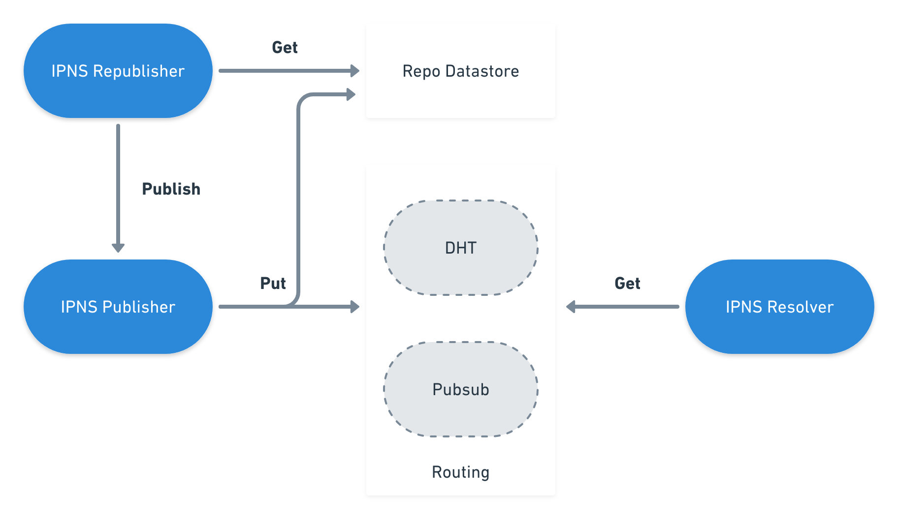

# IPNS - Inter-Planetary Naming System

Authors:

  - Vasco Santos ([@vasco-santos](https://github.com/vasco-santos))
  
Reviewers:

  - ...

-----
  
# Abstract

IPFS is powered by content-addressed data, which by nature is immutable: changing an object would change its hash, and consequently its address, making it a different object altogether. However, there are several use cases where we benefit from having mutable data. This is where IPNS gets into the equation.

All things considered, the IPFS naming layer is responsible for the creation of:

  - mutable pointers to objects
  - human-readable names

# Status of this spec


# Organization of this document

  - [Introduction](#introduction)
  - [Building Blocks](#building-blocks)
  - [Implementation Details](#implementation-details)
  - [Overview](#overview)
  - [API Spec](#api-spec)

# Introduction

IPFS is mostly concerned with content-addressed data, which by nature is immutable. That is, when a file is added to the network, its reference in the system is an immutable content-addressed hash. This characteristic is a security mechanism, which guarantees that a peer has not modified the original content of a file. Accordingly, this characteristic is crucial in a network composed of anonymous peers.

Nevertheless, there are some requirements that do not match with immutable data. Taking into account a use case, where a web application will have its static files stored in IPFS. Each time a static file needs to be modified, its directory hash will be automatically modified. As a consequence, the address previously used for getting that static file needs to be updated. As this is not pratical, IPNS was conceptualized to solve this.

IPNS was idealized based on [SFS](http://en.wikipedia.org/wiki/Self-certifying_File_System). It consists of a PKI namespace, where a name is simply the hash of a public key. As a result, whoever controls the private key has full control over the name. Accordingly, records are signed by the private key and then distributed across the network (in IPFS, via the routing system). This is an egalitarian way to assign mutable names on the Internet at large, without any centralization whatsoever, or certificate authorities.

# Building Blocks

## IPNS Record

An IPNS record is a data structure composed by:

- 1. **Value** (bytes)
- 2. **Validity** (bytes)
- 3. **Validity Type** (uint64)
  - Allows us to define if the record is valid under certain conditions
  - Only supporting expiration date with `validityType = 0` for now
- 4. **Signature** (bytes)
  - Concatenate value, validity field and validity type
  - Sign the concatenation result with the provided private key
- 5. **Sequence** (uint64)
  - Represents the current version of the record (starts at 0)
- 6. **Public Key** (bytes)
  - Public key used for the creation 
  - Note: This used to be stored separately, but it is stored in the IPNS record now, as a result of some issues storing the public key inline with the record. Eventually, when we switch for using ed25519 for public keys (instead of RSA), the public key will be inlined into the peer ID itself, so we will not need to store it in the IPNS record anymore.
- 7. **ttl** (uint64)
  - A hint for how long the record should be cached before going back to, for instance the DHT, in order to check if it has been updated.
  
These records are stored locally, as well as spread accross the network, in order to be accessible to everyone. For storing this structured data, we use [Protocol Buffers](https://github.com/google/protobuf), which is a language-neutral, platform neutral extensible mechanism for serializing structured data.

```
message IpnsEntry {
	enum ValidityType {
		// setting an EOL says "this record is valid until..."
		EOL = 0;
	}
	required bytes value = 1;
	required bytes signature = 2;

	optional ValidityType validityType = 3;
	optional bytes validity = 4;

	optional uint64 sequence = 5;

	optional uint64 ttl = 6;

	optional bytes pubKey = 7;
}
```

The record is stored locally, in order to allow us to understand which is the most recent record in the network, since it will be stored locally by the peer using the keys used to generate it.

**Note**: validity must be with nanoseconds precision.

#### Local record

This record is stored in the peer's repo datastore and contains the **latest** version of the IPNS record published by the provided key. This record is useful for republishing, as well as tracking the sequence number.

**Key format:** `/ipns/base32(<HASH>)`

Note: Base32 according to the [RFC4648](https://tools.ietf.org/html/rfc4648).

#### Routing record

The routing record is also stored in the datastore of the IPFS nodes, once they receive the data. As we intend to remove IPNS entries from the routing system when the record expires, we must have a different record identifier from the local record.

**Key format:** `/ipns/BINARY_ID`

The two routing systems available for IPNS are the `DHT` and `pubsub`. As the `pubsub` topics must be `utf-8` for interoperability among different implementations

# Implementation Details

## IPNS Publisher

Flow for publishing an IPNS record:

1. Get the private key to use
  - the default key is the node's private key
  - a generated key may also be provided
2. Verify if the value provided exists before proceeding with publish (optional through parameters)
3. Get the peer id (using the private key)
4. Start publishing the record
  1. Verify if a local record already exists
    - If it exists:
      - unmarshal the obtained record
      - increment the sequence number (if the new value is different from the already stored)
      - update the value
    - If it does not exist:
      - try to get the record from the routing system
      - if it is found, unmarshal the obtained entry and do the steps above
  2. Create a new record with the previous updates, or create a new one if the record was not found.
  3. Marshal the record using the protocol Buffer
  4. Put the local record into the repo's datastore using the local record key
  5. Put the routing record to the routing, according to the systems available (DHT / Pubsub)
  6. Put the public key used to the routing
    
## IPNS Resolver

Flow for resolving an IPNS record:

1. Get multihash from the name
2. Get the peer id from the hash
3. Get public key from the network / from the record if embedded
  - Note: Name should be the hash of a public key retrievable from IPFS.
4. Get value from the routing (if offline only use the local datastore)
5. Unmarshal data
6. Validate record
  - Use the public key to verify the record signature
  - Check validity

## IPNS Republisher

IPNS republisher gets in action each 4 hours (by default). Accordingly, the republisher will get the old record from the local repo and publish it with an updated validity in each cycle.

## Overview



# API Spec

  - <https://github.com/ipfs/interface-ipfs-core/blob/master/SPEC/NAME.md>

# Implementations

  - <https://github.com/ipfs/js-ipfs/tree/master/src/core/ipns>
  - <https://github.com/ipfs/go-ipfs/tree/master/namesys>
