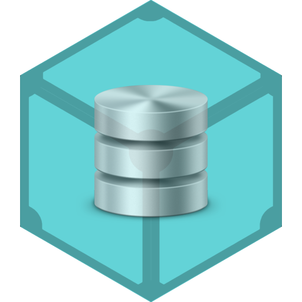

# IPFS Repo Spec
Author[s]: [Juan Benet](github.com/jbenet)

Reviewer[s]:

* * *

The [Spec](../) for IPFS node repositories.

This spec defines an IPFS Repo, its contents, and its interface. It does
not specify how the repo data is actually stored, as that is done via
swappable implementations.

## Definition

A `repo` is the storage repository of an IPFS node. It is the subsystem that
actually stores the data ipfs nodes use. All IPFS objects are stored in
in a repo (similar to git).

There are many possible repo implementations, depending on the storage media
used. Most commonly, ipfs nodes use an [fs-repo](fs-repo).

Repo Implementations:
- [fs-repo](fs-repo) - stored in the os filesystem
- [mem-repo](mem-repo) - stored in process memory
- [s3-repo](s3-repo) - stored in amazon s3

## Repo Contents

The Repo stores:
- version - the repo version, required for safe migrations
- keys - cryptographic keys, including node's identity
- config - node configuration and settings
- datastore - locally stored ipfs objects and indexing data
- logs - debugging and usage event logs
- locks - process semaphores
- hooks - scripts to run at predefined times (not yet implemented)

### version

Repo implementations may change over time, thus they must all be recognizable.
For example, the `fs-repo` simply includes a `version` file with the contents.

### keys

A Repo holds the keys a node has access to, for signing xor encryption.
This includes:

- a special (private, public) key pair that defines the node's identity
- (private, public) key pairs
- symmetric keys

TODO: perhaps support ssh-agent style delegation.

### config

The node's config is a tree of variables, used to configure various aspects
of operation. For example:
- the set of bootstrap peers IPFS uses to connect to the network
- the Swarm, API, and Gateway network listen addresses

### datastore

IPFS nodes stores some merkledag objects locally. These are either pinned
(stored until they are unpinned) or cached (stored until the next repo garbage
collection).

The name "datastore" comes from
[go-datastore](https://github.com/jbenet/go-datastore), a library for
swappable key-value stores. Like its name-sake, some repo implementations
feature swappable datastores, for example:
- an fs-repo with a leveldb datastore
- an fs-repo with a boltdb datastore
- an fs-repo with a union fs and leveldb datastore
- an fs-repo with an s3 datastore
- an s3-repo with a cached fs and s3 datastore

This makes it easy to change properties or performance characteristics of
a repo without an entirely new implementation.

### logs

A full IPFS node is complex. Many events can happen, and thus ipfs
implementations capture event logs and (optionally) store them for user review
or debugging.

### locks

IPFS implementations may use multiple processes, or may disallow multiple
processes from running simultaneously on the same repo. This synchronization
is accomplished via locks on the repo itself.

All repos contain the following standard locks:
- `repo.lock` - prevents concurrent access to the repo.
  Must be held to read or write.

### hooks (TODO)

Like git, IPFS will have `hooks`, a set of user configurable scripts that
can be run at predefined moments in ipfs operations. This makes it easy
to customize the behavior of ipfs nodes without changing the implementations
themselves.

## Notes

#### A Repo uniquely identifies an IPFS Node

A repository uniquely identifies a node. Running two different ipfs programs
with identical repositories -- and thus identical identities -- will cause
problems.

#### Repo implementation changes MUST include migrations

DO NOT BREAK USERS' DATA. It is critical. Thus, any changes to a repo's
implementation must be accompanied by a migration tool.
See https://github.com/jbenet/go-ipfs/issues/537 and
https://github.com/jbenet/random-ideas/issues/33

#### Repo Versioning

A repo version is a single incrementing integer. All versions are considered
non-compatible. Repos of different versions MUST be run through the
appropriate migration tools before use.
